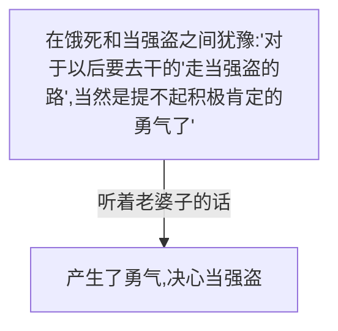

# 罗生门
## 自己的想法
### 分析

* 家将的思维转变

```mermaid
graph TB
    A[在饿死和当强盗之间犹豫:'对于以后要去干的'走当强盗的路',当然是提不起积极肯定的勇气了']
    --听着老婆子的话-->
    B[产生了勇气,决心当强盗]
```

### 疑问
* 为什么点着火不寻常
    >他心里明白，在这儿点着火的，绝不是一个寻常的人

* 为什么家将会恐惧
    >家将带着六分恐怖四分好奇的心理，一阵激动，连呼吸也忘记了。