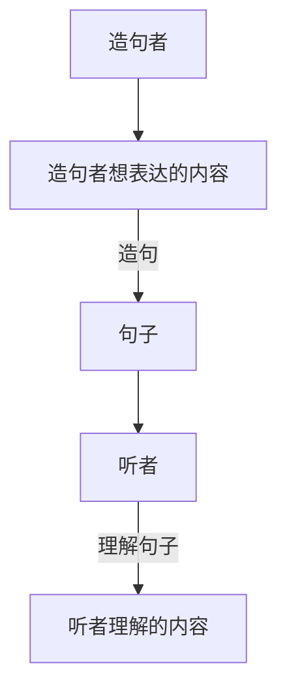

# 时态

句子的”现在“：造句者在造句开始的时刻(或延续到造句结束)

句子的时态取决于造句者想表达的内容

## 进行时：描述发生在*极短时间的事

\* 人的感觉上是一瞬间的时间，如看到的一瞬间等

* 现在进行时：”现在“发生的事(造句者造句时发生的事)

    > Q: What is he doing? (这里可能有错，不知道是is还是does,总之是在问：”他在干嘛“）
    > A: He is washing the car.
    > 结合上下文得知回答句发生在造句者被问到问题时的瞬间，即”现在“

* 过去进行时：在过去一个极短时间内发生的事

    > He was washing the car \*when I suddenly saw him.
    \*标志句子时态为过去进行时
    \*when I ... 标志句子表达的是一个很短的时间内的事
    \*saw 标志句子表达的时间发生在相对于”现在“的过去

* 将来进行时：在将来的一个极短时间内发生的事

    > He will be washing the car *this time tomorrow.
    > \*this time 标志句子时间发生在”现在“
    > \*tomorrow标志句子时间发生在相对于”现在“的将来
    > \*结合以上两点即句子时间发生在将来的一个极短时间

## 完成时：描述\*已(会)完成的事

\*在现在和过去完成时中已完成的事是事实，而在将来完成时中指造句者的看法(事情如何发展)

* 现在完成时: 说明过去发生的事在”现在“来看是已经完成的

    > He has washed the car.
    > 从过去发生持续到现在完成，或过去发生并完成影响持续到现在

* 过去完成时: 说明过去发生的事在相对于”现在“的过去某个特定的事发生前完成

    > He had washed the car before I got to his house.
    > 在"got to his house" 这一过去发生的事之前发生并完成"washed the car"

* 将来完成时: 说明一件事在将来某个时间之前会完成(造句者的主观看法)

    > He will have wash the car by next week

## 一般时

* A: 信息足够时，句子描述的是真理，客观存在，经常性，习惯性的事时为一般时
* B: 信息不足，即描述的事即不是发生在很短时间内容也不是完成了的事

* 一般现在时: 表示句子发生在”现在“

    > A: He washes the car four times a week.
    > A: 表示经常性的事
    > B: He washes the car.
    > B: 只说明了”他洗车“没有其他内容

* 一般过去时: 表示句子发生在相对于”现在“的过去

    > B: He washed the car yesterday.
    > B: 只说明”他昨天洗车“没有说明出在某一个极短时间内的事，也没有说明这件事是否完成

* 一般将来时: 表示句子发生在相对于”现在“的将来

    > B: He will wash the car tomorrow.
    > B: 只说明”他明天洗车“没有说明出在某一个极短时间内的事，也没有说明这件事是否完成

## 完成进行时
