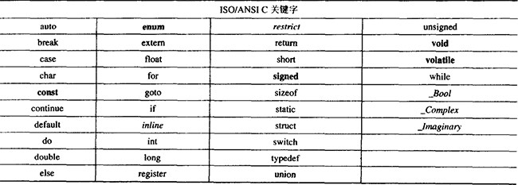
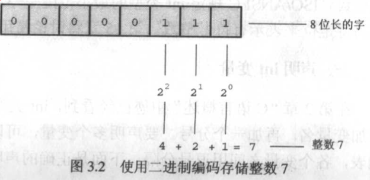
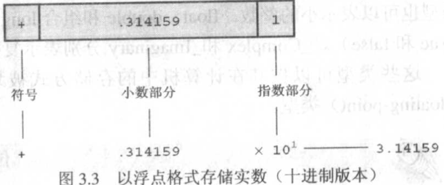

# Syntax

## 典型C程序的组成

| #include<...> （预处理器指令）  
| ...（其他预处理器指令）  
| 自定函数的声明（可选项）  
|  
| 主函数main()  
----|（组成函数的语句）  
----|（主函数内的其他函数）  
-----------|（其他函数内的语句）  
| 自定函数的实现（可选项）  

// TODO
> 自定函数细节在下方详述  

## 预处理(preprocessing)

C 编译器在编译前会对源代码进行预处理  

### #include <...> 与头文件

告诉文件包含尖括号内容的全部信息，相当于把文件的内容粘贴在此处  
头文件（xxx.h）一般包括变量声明、常量定义、函数声明  
编译器在链接部分会使用头文件寻找库代码内函数的具体实现  
[C标准库的头文件列表](https://m.runoob.com/cprogramming/)  

## 定义函数与main()函数

```c
定义函数返回值类型的关键字 函数名(定义函数接受参数类型的关键字)
{
    组成函数实现的语句
}
```

函数名后的圆括号`()`说明这是一个函数  
函数名左侧的关键字定义函数的返回值类型，返回给主调函数（调用该函数的函数，main()函数返回给操作系统）  
函数名右侧括号内的关键字定义函数接受参数值的类型，不接受参数填`void`  
花括号`{}`界定函数体的开始与结束  

### 典型C程序的main()函数  

```c
int main(void)
{
    /* 其他语句和函数调用 */
    return 0;
}
```

典型C程序从main()函数开始执行，int表示main()函数返回整数值，void表示函数不接受参数  
return 0 返回给操作系统表示程序正常运行结束  

### 添加自制函数

#### 在main()前定义函数

直接把要添加的函数的实现放到main()函数头前，何时调用取决于main()内在何处调用  

```c
void ShowMessage(void)
{
    // 实现略
}

int main(void)
{
    ShowMessage();
    return 0;
}
```

#### 使用函数原型

```c
void ShowMessage(void); // ShowMessage()函数原型，声明ShowMessage()函数

int main(void)
{
    ShowMessage();
    return 0;
}

void ShowMessage(void)
{
    // 实现略
}
```

#### // TODO 单独的函数实现源文件

将函数原型写入头文件  
在包含main()函数的源文件内引用包含函数原型的头文件，然后与包含函数实现的源文件一起编译  

#### // TODO 将函数实现制成动态库或静态库

将函数原型写入头文件  
在包含main()函数的源文件引用该头文件  
将函数实现制作成库代码  

## 语句 (statements)

语句都以分号结尾  

### 声明语句 (declaration statements)

#### 定义性声明 （defining declaration）

`关键字 标识符;`  
`关键字 标识符, 标识符;`  
声明一个（或多个）变量并为其分配内存空间（或称定义变量），变量需要先定义才能使用，定义可以放在代码块的任何位置  
**关键字：** 关键字为语言保留使用，在程序内不能用作其他目的（除注释）  
**标识符：** 为变量、函数或其他实体所选的名字  
**标识符命名规则：** 大小写字母、数字、下划线，区分大小写并且只能字母或下划线开头  
**保留标识符：** 标准库函数的名字(如printf），一些系统和C库使用的以下划线开头的标识符，这些也不能使用  

> 标识符命名其他规则：  
> C99标准标识符最大长度为63字符  

**一般标识符命名方法：**  

下划线：单词间用下划线连接  
> user_name  

驼峰：   单词间直接连接但首字母大写（除了开头）  
> userName  

帕斯卡：单词间直接连接且全部首字母大写  
>UserName  


> 粗体为C90新增，斜体为C99新增

#### 引用性声明 （referncing declaration）

`extern 关键字 标识符;`  
不会分配内存空间  
// TODO 具体内容下方详述  

### 赋值语句 (assignment statements)

`左值 = 右值;`  

> 例：将值1赋予变量num  
> `num = 1;`  

// TODO 左值和右值相关内容下面详述  

### 函数调用语句 (function statements)

`functionName(acturalArgument);`  
键入函数名和括号后输入要传递的参数，此处无参数不能输入`void`  
程序运行到函数调用后控制权将移交给被调函数直至函数运行结束将控制权返回给主调函数  
**actural argument(实际参数)：** 实际传递给函数的参数  

### 控制语句 (control statements)

详见流程控制  

#### return;

`return value;`  
结束当前函数，并返回一个值，`value`可以是常量或变量  

### 空语句 (null statements)

`;`  
就一个分号，不做任何事情  

## 输入 & 输出

### 输入函数

#### scanf();

从标准输入获取输入信息  

`scanf("格式说明符", &变量名);`

### 输出函数

#### printf();

格式化输出(printf formating)，可以特定格式输出参数  

// TODO 输出各种类型的变量的测试，指针数组等  
// TODO 格式说明符之类的  

```c
int num = 10;
printf("string"); // string
printf("\n");     // 换了一行
printf("%d",num); // 10
```

**显示八进制和十六进制数**

使用`%o`, `%x`, `%#o`, `%#x`  

```c
printf("%o", 16); //八进制输出：2
printf("%x", 16); //十六进制输出：1
printf("%#o", 16);//带符号八进制输出：02
printf("%#x", 16);//带符号十六进制输出：0x1
```

## 数据的存储与处理

### 计算机中数据的存储

**位(bit)：**最小的存储单位，容纳0或1（或称该位被置为"关"或"开"）  
**字节(byte)：**1字节=8位，1字节包含256种可能的组合（2^8=256）  
**字(word)：**：取决于机器，8位，16位，或更高  

#### 整数 （integer）

没有小数部分的数（小数点以及点后数字）  
以二进制存储，在一个8位字节或其他存储空间中存储左侧空位以0填充  
  

#### 浮点数 （floating-point)

**添加了小数点的数**

> ```c
> printf("%.2f", 7); //输出：0.00
> printf("%.2f", 7.);//输出：7.00
> ```

浮点数被分为小数部分和指数部分以二进制存储  
以十进制方式显示的存储方式示例  
  


### C数据类型与变量及常量

#### int类型

有符号整数，一般存储在计算机的一个字中，最小为16位  
一般为16位或32位，对应的取值范围为`-32768-32767`  或 `-2^31~2^31-1`  
C标准规定int最小取值范围为`-32767-32767`（因为使用原码计数所以比一般情况少1）  

**关于取值范围最小值的细微差别**  

》》**计算机采用二进制补码存储数据**  
C标准规定的取值范围采用原码计数  
[int取值范围计算](https://www.cnblogs.com/hoip/articles/4555415.html)  
[关于原码、反码、补码](https://blog.csdn.net/zl10086111/article/details/80907428)  
原码：最高位为符号位其余为数值位  
反码：原码基础上将数值位取反  
补码：反码基础上数值位+1  

>例：  
>*使用原码：*  
>最高位0为正，1为负，由此最大值和最小值为  
>
> 0111111111111111 = 32767  
> ↑最高位  
> ↓最高位  
> 1111111111111111 = -32767  
>
>*使用补码：将所有原码转成补码后表示数值*  
>
>// TODO  
> 0111111111111111 = 32767  // 补码同原码  
> ↑最高位  
> ↓最高位  
> 1111111111111111 = -32767  
> 1000000000000001 = -32767  // 转为补码  
>
> 使用原码表示时0有两种表示（正0和负0）  
> `0 : 0000000000000000` (原码）  
> `-0: 1000000000000000` (原码)  
> 而使用补码表示时`-0`的二进制表示与0相同  
> `-0: 0111111111111111` (数值位取反)  
> `-0: 0000000000000000` (数值位加1，进位溢出全变为0，补码结果二进制表示)  
> 故使用补码时取值范围为  
> -32767 : 1111111111111111  
> 到  
> 32767   : 0111111111111111  
> 加上使用补码后不会从原码转成的补码二进制表示↓，人为规定代表-32768  
> -32768 : 1000000000000000  
> 其他大小的情况同理  

**定义与初始化int变量**  

```c
/* 定义变量：声明变量并为其分配存储空间 */
int 变量名;
int 变量名1, 变量名2;

/* 初始化/赋值变量：为变量对应的存储空间赋值 */
变量名 = 值;

/* 定义并初始化变量：声明变量并为其分配存储空间同时赋值 */
int 变量名 = 值;
int 变量名1 = 值, 变量名2 = 值
```

> 定义但未初始化的变量将使用内存中的随机值  

**C代码中的int常量**

* 书写在源码中不含小数点和指数的数
    > 例：21, 0 , -9
* 字符
    > 例：'c'

// TODO 指针等其他数据类型  
// TODO 叠加字符（'AA'等值的产生规律，'AA' =! 'A'）  

#### int类型变种

通过在`int`前添加一下关键字使用其他整数类型，`int`可省略  
因为C语言标准只规定最小范围所以比一般范围小1（使用原码表示比用补码少1） 

|                 | short(int)                   |               long(int)                | long long(int) |
| :-------------- | :--------------------------- | -------------------------------------- | -------------- |
| 一般大小         | 16位                         | 32位                                   | 64位           |
| C语言标准最小范围 | -32767~32767(-2^15-1~2^15-1) | -2147483647~2147483647(-2^31-1~2^31-1) | -2^63-1~2^63-1 |
| 一般范围         | -32768~32767 (-2^15~2^15)  | -2147483648~2147483647(-2^31~2^31)     | -2^63~2^63     |

**unsigned (int) **

无符号的非负值
也可用在以上关键字之前表示无符号的`short`, `long`, `long long`  

**signed**

与有符号类型一起使用使数据类型更加明确  


#### 八进制和十六进制(暂且只考虑int类型）

**表示法**

十六进制：前缀0x或0X  
八进制： 前缀0  

**关系**

一位十六进制数可由4位二进制数表示（2^4=16)  
> 例：0x3 = 0011, 0x5 = 0101, 0x35 = 0011 0101  
一位八进制数可由3位二进制数表示（2^3=8)  
> 例：03 = 011, 05 = 101, 035 = 011101  


## 运算符


