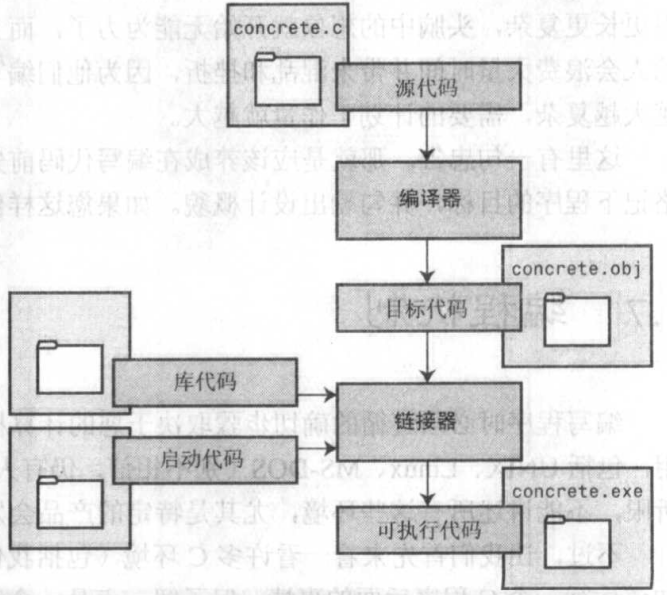

# 关于C和计算机的一些内容

## 关于C

### C语言标准

#### K&R C

*The C Programming Language*是公认的C标准，称之为K&R C或经典C。  
UNIX 实现提供的库成为C标准库。  

#### C89/C90

美国国家标准协会(ANSI)1989年发布了一套标准，定义了C语言和C库。国际标准化组织(ISO)与1990年采用了这套标准(ISO C)。
ISO C 和 ANSI C 是完全相同的标准，ANSI/ISO 标准的最终版本称为C89 或 C90。  
由于ANSI C先公布，所以常用ANSI C。  

#### C99

目标一：支持国际化编程。  
目标二：调整现有实践致力于解决明显的缺陷。  
目标三：适应科学和工程项目中的关键数值计算。  

#### C11

处于对编程安全的担忧，不那么强调“信任程序员”目标。  

### 使用C的七个步骤

#### 1.定义程序的目标

明确希望程序做的事，思考程序需要哪些信息，要进行哪些计算和控制，以及程序应该报告哪些信息。  
应该用一般术语来描述问题。  

> 例：一个产生随机数的程序
> 程序需要接受数字输入以明确产生随机数的范围并产生范围内的随机数后显示

#### 2.设计程序

思考如何用程序来完成需要完成的任务。  
要决定在程序中如何表示数据，以及处理数据的方法。  
<font color='green'>编码前先把一二步骤的内容写下来可能会很好。</font>  
<font color='green'>编写大型的程序很有必要。</font>

> 例：一个产生随机数的程序
> 1. 打开终端窗口
> 2. 显示提示输入方式的消息
> 3. 按照特定方法获取用户的输入
> 4. 过滤非数字输入以及超过支持范围数字输入
> 5. 在用户进行非法输入时进行提示并返回`4`
> 6. 产生输入范围内的随机数
> 7. 将数字结果显示在窗口
> 8. 提示用户输入继续或退出的按键
> 9. 获取输入并识别继续或退出
> 10. 根据识别结果重复`5-6`或退出

#### 3.编写代码

#### 4.编译

编译的细节取决于编程的环境。  
C编译器会运行链接器把源代码和C库的代码合并。  
编译器还会检查源代码的错误，理解错误报告很重要。  

#### 5.运行

#### 6.测试和调试

调试：查找并修复程序错误的过程。  

#### 7.维护和修改

修复错误，添加功能，修改实现方式  

### 提高源码可读性

* 选择有意义的变量名
    ```c
    int appleNum, melonNum, totalNum; // √
    int a, m, n; // X
    ```
* 使用注释
* 使用空行分隔
    ```c
    /* 这里的注释是用来说明在哪里分隔 */
    /* 预处理器指令 */
    #include <stdio.h>

    /* 函数声明 */
    void ShowMenu(void);

    int main(void)
    {
        /* 定义变量 */
        int appleNum, melonNum, totalNum;

        /* 赋值和计算 */
        appleNum = 5;
        melonNum = 4;
        totalNum = appleNum + melonNum;

        /* 其他函数调用 */
        printf("There are %d apple and %d melon.\n", appleNum, melonNum);
        printf("The total is %d.\n", totalNum);

        return 0;
    }
    
    void ShowMenu(void)
    {
    // 略
    }
    ```
* 一行一个语句
* 在程序开始处说明文件名和程序的目的
    ```c
    /* fathm_ft.c -- 把两个 fathoms 换算成英尺 */
    ```

### 调试程序的方法

#### 语法错误

若程序存在语法错误在编译时编译器会报告错误，只需记住语言的语法，以及发现错误的位置可能在实际位置之后  

#### 语义错误

语法正确但逻辑错误导致结果不对  

* 根据代码还原逻辑运算过程
* 在特定位置使用输出语句获取变量值的变化
* 使用调试器一步步执行程序

## 编程机制

* C程序编译过程
    编译器把源代码转换成中间代码文件，链接器把中间代码文件和启动代码以及库代码合并，生成可执行文件。  
* 中间文件
    一般把源代码转换为机器语言代码放在目标代码文件作为中间文件。  
    目标文件缺少启动代码，无法运行。  
* 启动代码
    程序和操作系统之间的接口。
* 链接器的工作
    把编写的目标代码、系统的标准启动代码和要用到的库代码合并成一个可执行文件。  



## 计算机基础内容

### 组成及工作方式

基本部件：中央处理单元(CPU)、随机存取内存(RAM)、永久内存存储设备。  

* CPU
    承担绝大部分的运算工作。  
    工作方式：从内存中读取并执行一条指令，再从内存中读取并执行下一条指令。  
    CPU有自己的小工作区——由若干个寄存器组成。  
    一个寄存器存储下一个指令的内存地址，CPU使用该地址来获取和更新下一条指令。  
    获取指令后，CPU在另一个寄存器中存储该指令，并更新第一个寄存器存储下一条指令的地址。  
    CPU能理解的指令有限(指令的集合称为指令集)，并且这些指令相当具体(移动一个数字)。  

* RAM
    存储程序和文件的工作区。  

* 永久内存存储设备
    关闭计算机后，也不会丢失之前存储的程序和文件。  

### 基本工作原理及相关内容

存储在计算机中的所有内容都是数字，计算机以数字形式存储数字和字符。  
每个字符都有一个数字码，计算机载入寄存器的指令也以数字形式存储，指令集的每条指令都有一个数字码。  
计算机程序最终必须以数字码来表示(机器语言)。  

基本工作原理：如果希望计算机做某事，就必须为其提供特殊的指令列表(程序)。  
必须用计算机能直接明白的语言(机器语言)创建程序。  

### 高级计算机语言和编译器

使用高级编程语言可以在更抽象的层面表达意图。  
使用编译器将高级程序语言翻译成机器语言。  
不同CPU制造商使用不同的指令系统和编码格式，编译器可以把一种高级语言程序转换成各种不同类型CPU使用的机器语言程序。  