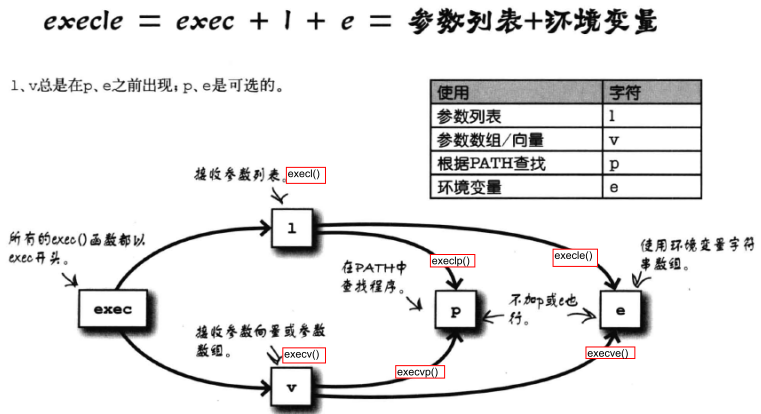
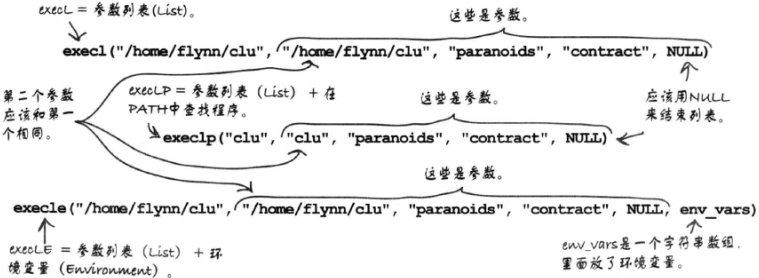
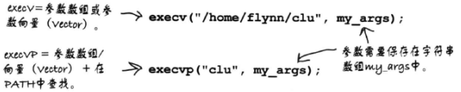

# 进程与系统调用
## 内核
内核是计算机中最重要的程序，主管进程、存储器和硬件。  

### 进程
内核创建进程并分配资源使程序运行，同时观察进程的情况。  

#### 查看进程
操作系统会用一个数字来标识进程，即进程标识符(process idenifier ,PID)  

##### windows
CMD中：  
```
tasklist
```

##### Linux
```
$ ps -ef
```

### 存储器
内核分配进程使用的存储器大小，内核还会把部分存储器交换到磁盘来增加虚拟存储器空间。  

### 硬件
内核利用设备驱动器与连接到计算机上的设备交互，程序可以直接使用这些设备。  

## 系统调用
系统调用是操作系统内核中的函数，用来与内核对话。  

### 系统调用函数
#### system()
头文件：stdlib.h  
```c
system(字符串);
```
接受一个字符串参数并把它作为命令执行。  

##### 问题
* 容易被攻击
    通过在字符串参数中注入命令，可以使用程序运行各种命令。  

* 规范性
    字符串拼接的方式容易使命令出错。  
    可能受环境变量的影响。

#### exec系列函数
exec系列函数会通过运行其他程序来替换当前进程，新程序启动后PID和旧程序一样。  
新程序结束后不会回到旧程序。
新程序会继承旧程序的环境变量。  
exec系列函数可以分为列表函数和数组函数两组。  
头文件：unistd.h  

##### 命名方式


##### 列表(list)函数—execl()、execlp()、execle()
###### 参数Part1——程序
execl()和execle():程序完整路径。  
execlp():命令名，在PATH环境变量里寻找。  

###### 参数Part2——命令行参数
依次列出命令行参数字符串，用逗号分隔。  
第一个命令行参数是程序名(程序完整路径)，即参数一和参数二的第一项(第二个参数)是一样的。  

>MinGW会被命令行参数的空格影响
>如果把"I  like"和"turles"两个参数传给exec()，MinGW可能发送三个参数"I"、"like"、"turles"

###### 参数Part3——NULL
命令行参数部分的尾部加上一个NULL表示结尾。  

###### 参数Part4——环境变量——execle()
传递环境变量的字符串数组。  
数组要以`NULL`为结尾。  
>字符串内容类似于："POWER=4"、"PORT=OPEN"  

###### 图解


##### 数组(向量,vector)函数—execv()、execvp()、execve()
差别只在于参数命令行参数使用数组。  


##### 传递环境变量实例
被执行文件：  
```c
/* diner_info.c */
#include <stdio.h>
#include <stdlib.h>

int main(int argc, char * argv[])
{
    printf("Diners: %s\n", argv[1]);
    printf("Juice: %s\n", getenv("JUICE"));
    return 0;
}
```
>stdlib.h中的getenv()可以读取环境变量的值。

生成程序：  
```
gcc diner_info.c -o diner_info
```

用来执行程序的程序：  
核心代码：  
```c
char *my_env[] = {"JUICE=peach and apple", NULL};
execle("diner_info", "diner_info", "4", NULL, my_env);
```

运行：  
execle()函数将设置命令行参数和环境变量，然后用diner_info替换当前进程。  

<font style='background: yellow'>注意：在Cygwin中，加载程序时需要用PATH变量，传递环境变量时要包含`PATH=/usr/bin`。  </font>

##### 系统调用出错
###### 检查是否出错
系统调用出错会返回`-1`。  
可在exec()函数后添加一句代码来判断是否出错。(成功运行会结束当前程序)  

###### 寻找出错原因
系统调用输出会把errno.h中定义的`errno`变量设置为相应错误码。  
可以使用string.h中的strerror()查询标准错误信息。  
```c
puts(strerror(errno));
```

errno的错误码：  

|  错误码  |      情况       |
| :------: | :------------: |
| EPERM=1  |   不允许操作    |
| ENOENT=2 | 没有该文件或目录 |
| ESRCH=3  |   没有该进程    |

#### fork()——克隆进程
头文件：unistd.h  
>在Windows中使用该函数需要安装Cygwin
><font color='orange'>我装了也没用</font>  

##### 函数的工作
fork()会克隆当前进程，新建副本从同一行(fork函数的下一行语句)开始运行相同程序。  
新建子程序中的变量和变量的值与父程序完全一样，只有PID不一样。  
fork()函数会向子进程返回0，向父进程返回非0值(用pid_t 类型的变量来接受)。以此来区分程序。  
<font color='green'>*//对父进程返回子进程的PID(非0）；对子进程返回为0(表示自身)*</font>  

##### 与exec()一起使用运行子程序
###### 流程
1. 用fork()复制进程
2. 用exec()执行程序

##### 其他关于fork()函数的信息
###### 写时复制(copy-on-write)
操作系统会让父子进程共享数据以提高fork()函数的速度。  
子进程要修改存储器时，操作系统会进行复制。  

###### 在Windows中使用类似的函数
CreateProcess()函数。  

#### exit()
调用此函数可以直接结束程序，并把接受的int参数作为退出状态。  
参数为0表示正常退出。  
没有返回值，不会失败的函数。  

##### 用exit()制造错误检查函数error()
```c
/* 调用方式：error("错误消息"); */
#include <stdlib.h>
#include <string.h>

void error(char * msg)
{
    fprintf(stderr, "%s: %s\n", msg, stderror(errno));
    exit(1);
}

```

