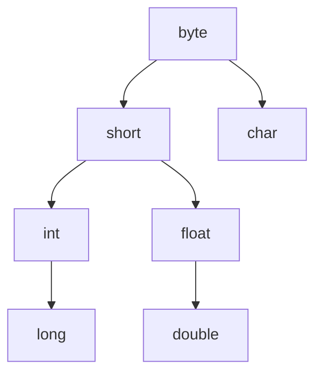

# Syntax

## Java程序结构

Java程序由类组成，必须有且只有一个位于类中的main()方法  

```text
package                    0个或1个，必须放在文件开始
import                     0个或多个，必须放在所有类前
public class Definition    0个或1个，文件名必须与该类名相同
class Definition           0个或多个
                           main()方法，位于类中，详见下
interface Definition       0个或多个
// 注释内容                 单行注释，可放于任何地方

/*
   注释内容                 多行注释，可放于任何地方
*/

/**
   注释内容                 文档注释，可用javadoc.exe提取
*/
```

### package

```Java
package packageName; // package ... 属于语句，末尾需要分号
```

一般package命名：com.平台名.程序/项目名  
> 例：  
> 农行APP：com.android.bankabc  
> 百度云盘APP：com.baidu.netdisk  
> 哔哩哔哩APP：tv.danmaku.bili  

当源文件位于某package内时必须有↓  

```
package 源文件所在的package名;
```

### import

### public class

使用`public class`声明一个公共类  
Java程序只能有一个公共类，且有公共类的源文件，文件名需与公共类名相同  

### class

使用关键字`class`声明一个新类  
例：  

```Java
class className
```

### main()方法

程序中必须有且只有一个main()方法  
必须用关键字`public`,`static`,`void`限定并传递参数`String[] args`  
例：  

```Java
class className {
    public static void main(String[] args) {
        语句...;
    }
}
```

**public**：指明所有的类都可以使用这个方法  
**static**：指明本方法是一个类方法，可以通过类名直接调用  
**void**： 指明本方法没有返回值  
**String[] args**：传递给main()方法的参数，名称为args，是String类的实例  

### interface

## Java 标识符

可用符号：大小写字母、下划线、美元符号、数字  
使用规则：区分大小写、不能以数字开头、最大长度65536字符、不能使用Java关键字  
其他：因为Java内置对Unicode字符编码的支持，所以可用使用汉字等其他字符，但最好不要用  

|            |              |   Java中的关键字          |            |              |
| :--------: | :----------: | :-------: | :--------: | :----------: |
|  abstract  |    assert    |  boolean  |   break    |     byte     |
|    case    |    catch     |   char    |   class    | const(保留字) |
|  continue  |   default    |    do     |   double   |     else     |
|    enum    |   extends    |   final   |  finally   |    float     |
|    for     |    goto(保留字)    |    if     | implements |    import    |
| instanceof |     int      | interface |    long    |    native    |
|    new     |   package    |  private  | protected  |    public    |
|   return   |   strictfp   |   short   |   static   |    super     |
|   switch   | synchronized |   this    |   throw    |    throws    |
| transient  |     try      |   void    |  volatile  |    while     |

## Java 分隔符

用于区别和分隔标识符、操作数、关键字、语句  

* 圆括号`()`
    1. 定义和调用方法时，用来**容纳参数列表**
    2. 在控制语句或强制类型转换组成的表达式中使用，用来**表示执行或计算的优先级**
* 花括号`{}`
    1. 用来包括自动初始化数据时，赋给数组的值
    2. 用来定义语句块、类、方法、局部范围
* 方括号`[]`
    1. 声明数组的类型
    2. 用来表示对数组的引用    
* 分号`;`
    终止一个语句
* 逗号`,`
    1. 变量声明中分隔变量表的各个变量
    2. for语句中将圆括号中的语句连接起来
* 空格` `
    //TODO

## Java 中的数据类型

  

### 基本数据类型

#### 整数类型

没有小数部分的数，最常用的为`int`类型  
  


#### 实数/浮点数类型

有小数部分的数，最常用的为`double`类型  
  

#### 布尔类型

| 类型    | 占用位数 |    取值范围    |
| :------ | ------- | ------------- |
| boolean | //TODO   | true 或 false |

取值只能为`true`或`false`，且不能与0，1互换  

#### 字符类型

| 类型 | 占用位数 | 取值范围 |
| :--- | :------ | :------ |
| char | 16      | '字符'   |

字符可用Unicode编码表示，`'\u四位十六进制数'`  
> 例：`'\u0041'` 表示 'A'  

**转义字符**  
一些字符无法直接在源码中以常量表示，需要使用转义字符  
  

#### //TODO 字符串类型

| 类型   | 占用位数 | 取值范围 |
| :----- | :------ | :------ |
| String | 可变     |         |

```Java
/* 字符串表示 */
" " // 有一个空格字符的长度为1的字符串
""  // 长度为0的空串

/* 字符串变量声明与赋值 */
String 变量名;  // 声明字符串变量
String s1, s2; // 同时声明多个字符串变量
String s1 = "String1", s2 = "String2";  // 声明多个变量并全部赋值
String s1, s2 = "可以但最好不要这样";    // 声明多个变量但部分赋值
s1 = "String1"; // 给变量赋值

/* 字符串拼接 */
String s1 = "String1", s2 = "String2";
String s3 = s1 + s2; // s3为String1String2
```

### 引用数据类型

### 空类型

### 数据类型转换

不同数据类型的值可以混合运算，但需要转换为同一类型  

#### 自动(隐式)类型转换

两个不同类型的数运算时，占用位数小的数据类型会自动转换为占用位数大的数据类型  



#### //TODO 强制(显式)类型转换

```Java
(数据类型)值    // 一般所见形式
(数据类型)表达式// 广泛形式(表达式整体为一个值)
```
##### 赋值

将占用位数大的变量赋给占用位数小的变量时需要进行强制类型转换  

##### 其他计算

在计算过程中防止信息丢失使用  

```Java
int intNum1 = 600000;
int intNum2 = 100000;
long longNum = intNum1 * intNum2;

/* 结果为-129542144, 因为两个int类型相乘结果为int，但值大于int范围发生上溢 */
System.out.println(longNum); 

/* 结果为60000000000，在计算时将其中一个操作数改为long类型，另一个会自动转换,但变量的类型不会改变 */
long longNum = (long)intNum1 * intNum2;
System.out.println(longNum);
```

## 变量

变量必须先声明才能使用，未初始化的变量不能使用  
`[修饰符]数据类型 标识符 [= 值]`                                // 声明单个变量，可选赋值  
`[修饰符]数据类型 标识符 [= 值], 标识符 [= 值]`     // 声明多个变量，可选全部赋值  
`[修饰符]数据类型 标识符 [= 值], 标识符`                 // 声明多个变量，可选部分赋值  

[修饰符可选，详见此](https://www.runoob.com/java/java-modifier-types.html)  

## 常量

### 字面常量

#### 整数类型

用数字表示的没有小数部分的数  

使用`l`后缀表示`long`类型常量  
使用`0`前缀表示八进制整数常量  
使用`0x`或`0x`表示十六进制整数常量  

#### 实数/浮点数类型

1. 用数字表示并带有小数部分的数  
2. 用E计数法(科学计数法)，可保留或省略小数点  

    ```Java
    /* 格式：aEb, 表示a乘以10的b次方 */
    double num;
    num = 32E2;
    num = 320E1;
    num = 3.2E3;
    /* 以上num的值都为3200 */
    ```

3. 用数字省略小数点但使用浮点数后缀

    ```Java
    float fNum  = 42F;
    double dNum = 42D;
    System.out.println(fNum);  // 42.0
    System.out.println(dNum);  // 42.0
    ```

浮点数常量默认为`double`类型，可用`f`或`f`后缀表示`float`类型  

#### 字符类型

使用`''`包围表示字符常量  
字符对应Unicode码，也为对应的十进制整数类型数值  

```Java
/* 例:
   A的Unicode码为\u0041，十进制值为65
*/
System.out.println(65 == 'A'); // 结果：true
```

#### 布尔类型

`true` 或 `false`  

### 符号常量

用标识符表示常量  
格式：`final 数据类型 标识符 [= 值] `  

> 方括号表示可选项  

```Java
// 例
final int COUNT;
final double PI = 3.14;
```

一般常量标识符使用全大写命名  
只使用`final`关键字定义符号常量时可以不初始化，但未赋值的符号常量不可使用，且常量只能赋值一次  

## 运算符和表达式

### 算术运算符

  

* 二元运算时操作数类型不同会自动转换
* 整数进行除法运算结果会直接丢弃小数部分
* 增/减量运算符只能用于变量
* `+`运算符在有一个操作数是字符串的情况下会进行字符串拼接，将另一操作数也作为字符串看待
    > 字符类型和整数/实数类型计算结果为整数/实数  

### 关系运算符

比较两个操作数的大小关系，并返回逻辑值(true 或 false)  

  

整数类型、实数类型、字符类型之间可相互进行所有关系运算  
其他类型只能和相同类型进行`==`和`!=`运算  

> 如：字符串和字符串，布尔类型和布尔类型  

### 布尔运算符

| 操作数 | 运算符 | 运算          | 详细                                              |
| :---- | :---- | :----------- | :------------------------------------------------ |
| 一元   | `!`   | 逻辑非(NOT)   | 将操作数取反                                       |
| 二元   | `&`   | 逻辑与(AND)   | 两边操作数都为真时表达式为真                         |
| 二元   | `|`   | 逻辑或(OR)    | 两边操作数有一个为真时表达式为真                     |
| 二元   | `^`   | 逻辑异或(XOR) | 两边操作数有一个为真且操作数不同时表达式为真          |
| 二元   | `&&`  | 简洁逻辑与    | 逻辑与基础上，左操作数为假直接得出结果而不检查右操作数 |
| 二元   | `||`  | 简洁逻辑或    | 逻辑或基础上，左操作数为真直接得出结果而不检查右操作数 |

`&`, `|`, `^`都会检查两个操作数，而`&&`和`||`只会检查一个操作数  

### 位运算符

只能对整数类型值使用，以二进制形式对操作数的每一位进行运算  

  

#### Java中按位右移(>>)运算左侧补位方式 // TODO严谨性有待考证

以下推算不使用二进制位表示符号，仅测试操作数的正负是否影响左侧补位，故符号与数值分离直接将十进制值转为二进制值  

若以0补位则应如下：  

10 二进制: 1010  
10 >> 1 : 1010 -> 0101 十进制: 5  

-10 二进制: -1010  
-10 >> 1 : -1010 -> -0101 十进制: -5  

实测与推算相同，故推测Java中按位右移(>>)运算左侧以0补位  

#### 赋值运算符

将占用位数大的变量赋给占用位数小的变量时需要进行强制类型转换  
  

#### 条件运算符

`表达式1?表达式2:表达式3`  
表达式1：必须为布尔类型  
表达式2：表达式1结果为true则运行，运行结果为整个条件表达式的结果  
表达式3：表达式1结果为false则运行，运行结果为整个条件表达式的结果  

#### 运算符优先级和结合顺序


### 表达式和语句以及作用域

**表达式**  

* 由操作数和运算符按语法组成的符号序列，用以表达运算或含义
* 每个表达式经过运算后都会产生一个值，一个表达式可以作为一个操作数参与运算形成更大的表达式

**语句**  

* 一个语句为一个完整的执行单元
* 语句以分号`;`结尾

**语句类型**

1. 赋值表达式
2. 变量的`++`和`--`运算
3. 方法调用
4. 对象创建表达式
5. 声明语句
6. 流程控制语句
7. 空语句

前四种为表达式语句，由表达式末尾加分号组成，**但不是所有表达式都能成为语句**  

```Java
int num; //TODO 不知道是什么语句
num;     // 一个变量是表达式但不是语句
'A';     // 一个常量是表达式但不是语句
num = 1; // 赋值语句
```

**语句块和作用域**

* 使用花括号`{}`划定语句块，语句块内可有多个语句也可为空  
* 每个语句块定义一个作用域，在作用域内定义的为局部变量，只在该作用域内可见  
* 语句可嵌套，嵌套时外层作用域包含内层，但内层不包含外层  

```Java
public static void main(String[] args) {
    {
        int a;
        System.out.println(a); // 可以使用变量a
    }
    {
        System.out.println(a); // 错误，变量a对此语句块内不可见
    }
}
```

## 输入

### Java Scanner类

[参见](https://www.runoob.com/java/java-scanner-class..html)  

### 命令行参数

在命令行运行`.class`文件时带上参数，接受参数的为main方法的args(一般的名字)字符串数组  

```Java
/* testArgs.java -- 测试main()方法接受命令行参数 */
class testArgs {
    public static void main(String[] args) {
        System.out.println(args[0]); // args[0]表示字符串数组args的第一个元素
        System.out.println(args[1]); // args[1]表示字符串数组args的第二个元素
        /* 其他参数以此类推，如果没有接受到对应的参数则println()方法会出错 */
    }
}
```

```DOS
javac testArgs.java

# 因为println()方法需要参数，所以如果没有带参数运行会出错
java testArgs
Exception in thread "main" java.lang.ArrayIndexOutOfBoundsException: Index 0 out of bounds for length 0
        at testArgs.main(testArgs.java:3)

java testArgs abc 1
abc
1

java testArgs 00 01b3
00
01b3
```

 [关于为什么运行字节码文件不加.class扩展名](关于Java.md#toc_7)  


## 输出

### System.out

```Java
System.out.print();  // print()方法：   向标准输出输出文本  
System.out.println();// println()方法：向标准输出输出文本和换行符  
```

> println -- print line 打印一行


