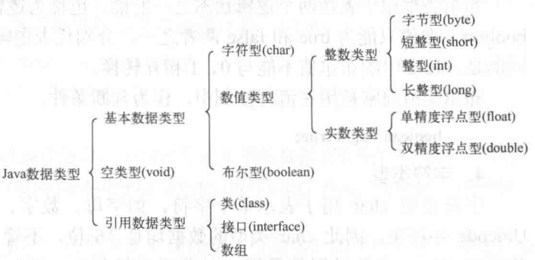
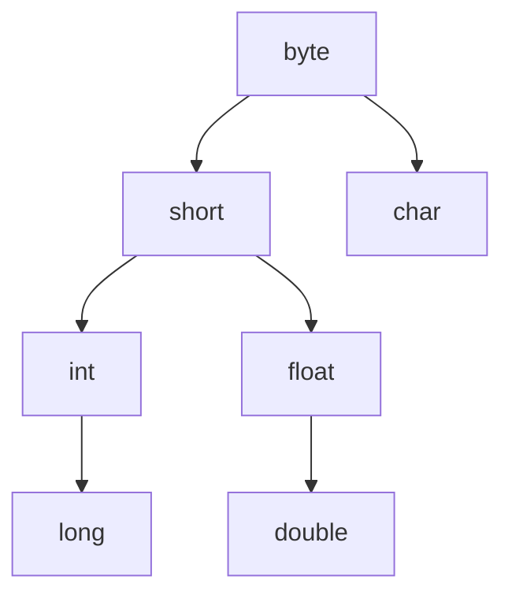
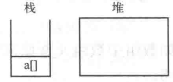
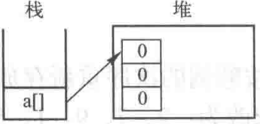
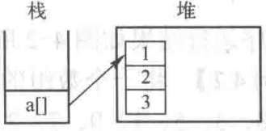
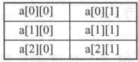
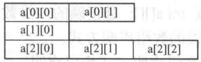

# Syntax

## Java程序结构

Java程序由类组成，必须有且只有一个位于类中的main()方法  

```text
package                    0个或1个，必须放在文件开始
import                     0个或多个，必须放在所有类前
public class Definition    0个或1个，文件名必须与该类名相同
class Definition           0个或多个
                           main()方法，位于类中，详见下
interface Definition       0个或多个
// 注释内容                 单行注释，可放于任何地方

/*
   注释内容                 多行注释，可放于任何地方
*/

/**
   注释内容                 文档注释，可用javadoc.exe提取
*/
```

### package

```Java
package packageName; // package ... 属于语句，末尾需要分号
```

一般package命名：com.平台名.程序/项目名  
> 例：  
> 农行APP：com.android.bankabc  
> 百度云盘APP：com.baidu.netdisk  
> 哔哩哔哩APP：tv.danmaku.bili  

当源文件位于某package内时必须有↓  

```
package 源文件所在的package名;
```

### import

用于导入其他类  

### public class

使用`public class`声明一个公共类  
Java程序只能有一个公共类，且有公共类的源文件，文件名需与公共类名相同  

### class -- 类

[详见下面向对象特征-类]()

### main()方法

程序中必须有且只有一个main()方法  
必须用关键字`public`,`static`,`void`限定并传递参数`String[] args`  
例：  

```Java
class className {
    public static void main(String[] args) {
        语句...;
    }
}
```

**public**：指明所有的类都可以使用这个方法  
**static**：指明本方法是一个类方法，可以通过类名直接调用  
**void**： 指明本方法没有返回值  
**String[] args**：传递给main()方法的参数，名称为args，是String类的实例  

### interface

## Java 标识符

可用符号：大小写字母、下划线、美元符号、数字  
使用规则：区分大小写、不能以数字开头、最大长度65536字符、不能使用Java关键字  
其他：因为Java内置对Unicode字符编码的支持，所以可用使用汉字等其他字符，但最好不要用  

|            |              |   Java中的关键字          |            |              |
| :--------: | :----------: | :-------: | :--------: | :----------: |
|  abstract  |    assert    |  boolean  |   break    |     byte     |
|    case    |    catch     |   char    |   class    | const(保留字) |
|  continue  |   default    |    do     |   double   |     else     |
|    enum    |   extends    |   final   |  finally   |    float     |
|    for     |    goto(保留字)    |    if     | implements |    import    |
| instanceof |     int      | interface |    long    |    native    |
|    new     |   package    |  private  | protected  |    public    |
|   return   |   strictfp   |   short   |   static   |    super     |
|   switch   | synchronized |   this    |   throw    |    throws    |
| transient  |     try      |   void    |  volatile  |    while     |

## Java 分隔符

用于区别和分隔标识符、操作数、关键字、语句  

* 圆括号`()`
    1. 定义和调用方法时，用来**容纳参数列表**
    2. 在控制语句或强制类型转换组成的表达式中使用，用来**表示执行或计算的优先级**
* 花括号`{}`
    1. 用来包括自动初始化数据时，赋给数组的值
    2. 用来定义语句块、类、方法、局部范围
* 方括号`[]`
    1. 声明数组的类型
    2. 用来表示对数组的引用    
* 分号`;`
    终止一个语句
* 逗号`,`
    1. 变量声明中分隔变量表的各个变量
    2. for语句中将圆括号中的语句连接起来
* 空格` `
    //TODO

## Java 中的数据类型

  

### 基本数据类型

#### 整数类型

没有小数部分的数，最常用的为`int`类型  
  


#### 实数/浮点数类型

有小数部分的数，最常用的为`double`类型  
  

#### 布尔类型

| 类型    | 占用位数 |    取值范围    |
| :------ | ------- | ------------- |
| boolean | //TODO   | true 或 false |

取值只能为`true`或`false`，且不能与0，1互换  

#### 字符类型

| 类型 | 占用位数 | 取值范围 |
| :--- | :------ | :------ |
| char | 16      | '字符'   |

字符可用Unicode编码表示，`'\u四位十六进制数'`  
> 例：`'\u0041'` 表示 'A'  

**转义字符**  
一些字符无法直接在源码中以常量表示，需要使用转义字符  
  

#### //TODO 字符串类型

| 类型   | 占用位数 | 取值范围 |
| :----- | :------ | :------ |
| String | 可变     |         |

```Java
/* 字符串表示 */
" " // 有一个空格字符的长度为1的字符串
""  // 长度为0的空串

/* 字符串变量声明与赋值 */
String 变量名;  // 声明字符串变量
String s1, s2; // 同时声明多个字符串变量
String s1 = "String1", s2 = "String2";  // 声明多个变量并全部赋值
String s1, s2 = "可以但最好不要这样";    // 声明多个变量但部分赋值
s1 = "String1"; // 给变量赋值

/* 字符串拼接 */
String s1 = "String1", s2 = "String2";
String s3 = s1 + s2; // s3为String1String2
```

### 引用数据类型

### 空类型

### 数据类型转换

不同数据类型的值可以混合运算，但需要转换为同一类型  

#### 自动(隐式)类型转换

两个不同类型的数运算时，占用位数小的数据类型会自动转换为占用位数大的数据类型  



#### //TODO 强制(显式)类型转换

```Java
(数据类型)值    // 一般所见形式
(数据类型)表达式// 广泛形式(表达式整体为一个值)
```
##### 赋值

将占用位数大的变量赋给占用位数小的变量时需要进行强制类型转换  

##### 其他计算

在计算过程中防止信息丢失使用  

```Java
int intNum1 = 600000;
int intNum2 = 100000;
long longNum = intNum1 * intNum2;

/* 结果为-129542144, 因为两个int类型相乘结果为int，但值大于int范围发生上溢 */
System.out.println(longNum); 

/* 结果为60000000000，在计算时将其中一个操作数改为long类型，另一个会自动转换,但变量的类型不会改变 */
long longNum = (long)intNum1 * intNum2;
System.out.println(longNum);
```

## 变量

变量必须先声明才能使用，未初始化的变量不能使用  
`[修饰符]数据类型 标识符 [= 值]`                                // 声明单个变量，可选赋值  
`[修饰符]数据类型 标识符 [= 值], 标识符 [= 值]`     // 声明多个变量，可选全部赋值  
`[修饰符]数据类型 标识符 [= 值], 标识符`                 // 声明多个变量，可选部分赋值  

[修饰符可选，详见此](https://www.runoob.com/java/java-modifier-types.html)  

## 常量

### 字面常量

#### 整数类型

用数字表示的没有小数部分的数  

使用`l`后缀表示`long`类型常量  
使用`0`前缀表示八进制整数常量  
使用`0x`或`0x`表示十六进制整数常量  

#### 实数/浮点数类型

1. 用数字表示并带有小数部分的数  
2. 用E计数法(科学计数法)，可保留或省略小数点  

    ```Java
    /* 格式：aEb, 表示a乘以10的b次方 */
    double num;
    num = 32E2;
    num = 320E1;
    num = 3.2E3;
    /* 以上num的值都为3200 */
    ```

3. 用数字省略小数点但使用浮点数后缀

    ```Java
    float fNum  = 42F;
    double dNum = 42D;
    System.out.println(fNum);  // 42.0
    System.out.println(dNum);  // 42.0
    ```

浮点数常量默认为`double`类型，可用`f`或`f`后缀表示`float`类型  

#### 字符类型

使用`''`包围表示字符常量  
字符对应Unicode码，也为对应的十进制整数类型数值  

```Java
/* 例:
   A的Unicode码为\u0041，十进制值为65
*/
System.out.println(65 == 'A'); // 结果：true
```

#### 布尔类型

`true` 或 `false`  

### 符号常量

用标识符表示常量  
格式：`final 数据类型 标识符 [= 值] `  

> 方括号表示可选项  

```Java
// 例
final int COUNT;
final double PI = 3.14;
```

一般常量标识符使用全大写命名  
只使用`final`关键字定义符号常量时可以不初始化，但未赋值的符号常量不可使用，且常量只能赋值一次  

## 运算符和表达式

### 算术运算符

  

* 二元运算时操作数类型不同会自动转换
* 整数进行除法运算结果会直接丢弃小数部分
* 增/减量运算符只能用于变量
* `+`运算符在有一个操作数是字符串的情况下会进行字符串拼接，将另一操作数也作为字符串看待
    > 字符类型和整数/实数类型计算结果为整数/实数  

### 关系运算符

比较两个操作数的大小关系，并返回逻辑值(true 或 false)  

  

整数类型、实数类型、字符类型之间可相互进行所有关系运算  
其他类型只能和相同类型进行`==`和`!=`运算  

> 如：字符串和字符串，布尔类型和布尔类型  

### 布尔运算符

| 操作数 | 运算符 | 运算          | 详细                                              |
| :---- | :---- | :----------- | :------------------------------------------------ |
| 一元   | `!`   | 逻辑非(NOT)   | 将操作数取反                                       |
| 二元   | `&`   | 逻辑与(AND)   | 两边操作数都为真时表达式为真                         |
| 二元   | `|`   | 逻辑或(OR)    | 两边操作数有一个为真时表达式为真                     |
| 二元   | `^`   | 逻辑异或(XOR) | 两边操作数有一个为真且操作数不同时表达式为真          |
| 二元   | `&&`  | 简洁逻辑与    | 逻辑与基础上，左操作数为假直接得出结果而不检查右操作数 |
| 二元   | `||`  | 简洁逻辑或    | 逻辑或基础上，左操作数为真直接得出结果而不检查右操作数 |

`&`, `|`, `^`都会检查两个操作数，而`&&`和`||`只会检查一个操作数  

### 位运算符

只能对整数类型值使用，以二进制形式对操作数的每一位进行运算  

  

#### Java中按位右移(>>)运算左侧补位方式 // TODO严谨性有待考证

以下推算不使用二进制位表示符号，仅测试操作数的正负是否影响左侧补位，故符号与数值分离直接将十进制值转为二进制值  

若以0补位则应如下：  

10 二进制: 1010  
10 >> 1 : 1010 -> 0101 十进制: 5  

-10 二进制: -1010  
-10 >> 1 : -1010 -> -0101 十进制: -5  

实测与推算相同，故推测Java中按位右移(>>)运算左侧以0补位  

#### 赋值运算符

将占用位数大的变量赋给占用位数小的变量时需要进行强制类型转换  
  

#### 条件运算符

`表达式1?表达式2:表达式3`  
表达式1：必须为布尔类型  
表达式2：表达式1结果为true则运行，运行结果为整个条件表达式的结果  
表达式3：表达式1结果为false则运行，运行结果为整个条件表达式的结果  

#### 运算符优先级和结合顺序


### 表达式和语句以及作用域

**表达式**  

* 由操作数和运算符按语法组成的符号序列，用以表达运算或含义
* 每个表达式经过运算后都会产生一个值，一个表达式可以作为一个操作数参与运算形成更大的表达式

**语句**  

* 一个语句为一个完整的执行单元
* 语句以分号`;`结尾

**语句类型**

1. 赋值表达式
2. 变量的`++`和`--`运算
3. 方法调用
4. 对象创建表达式
5. 声明语句
6. 流程控制语句
7. 空语句

前四种为表达式语句，由表达式末尾加分号组成，**但不是所有表达式都能成为语句**  

```Java
int num; //TODO 不知道是什么语句
num;     // 一个变量是表达式但不是语句
'A';     // 一个常量是表达式但不是语句
num = 1; // 赋值语句
```

**语句块和作用域**

* 使用花括号`{}`划定语句块，语句块内可有多个语句也可为空  
* 每个语句块定义一个作用域，在作用域内定义的为局部变量，只在该作用域内可见  
* 语句可嵌套，嵌套时外层作用域包含内层，但内层不包含外层  

```Java
public static void main(String[] args) {
    {
        int a;
        System.out.println(a); // 可以使用变量a
    }
    {
        System.out.println(a); // 错误，变量a对此语句块内不可见
    }
}
```

## 数组

### 定义一维数组

#### 方法1：声明数组引用变量后创建数组

```Java
/* 声明数组引用变量 */
数据类型[] 数组名; // 首选方法
数组类型 数组名[]; // 为C/C++ user的非首选方法
```

* 数据类型定义数组元素的数据类型，可以是基本数据类型或引用数据类型  
* 声明数组引用变量时，**方括号内不能有数字**  
* 这一步只定义了引用数组的变量，并没有给数组分配空间，故数组元素处于未初始化状态  

```Java
/* 创建数组并分配空间 */
数组名 = new 数据类型[数组长度];
a = new int[5]; //例
```

* 数组长度应为正整数  
* 创建数组后系统会自动初始化数组，所有元素会根据数据类型被赋予默认值  
    > 如：整型为0，实型为0.0，布尔型为false，字符型为'\0'  

```Java
/* 合并两条语句 */
数据类型[] 数组名 = new 数据类型[数组长度];
```

#### 方法2：初始化创建数组

```Java
数据类型[] 数组名 = {参数列表};
int[] a = {1, 2, 3, 4, 5};
```

* 创建后，数组内元素的值为参数列表的值

#### 一维数组初始化和引用，以及内存分配过程

##### 静态初始化

```Java
/* 使用初始化方法创建数组 */
数据类型[] 数组名 = {参数列表};
int[] a = {1, 2, 3, 4, 5};
```

##### 动态初始化和引用数组

创建完数组后，再给数组赋值  
使用数组名后跟中括号和中括号内的整数来引用数组的元素  

```Java
/* 创建完数组后元素会被赋予默认值 */
int a[] = new int[5]; // 此时a[0]到a[4]的值都是0

/* 动态初始化本身也是数组引用 */

for(int i = 0; i < a.length; i++) // 结束循环后a[0]到a[4]的值为1~5
    a[i] = i + 1;

String s[] = new String[2]; // 此时s[0]和s[1]的值为null
s[0] = "Hello ";
s[1] = "World.";
System.out.println(s[0] + s[1]); // Hello World.
```

##### 一维数组内存分配

* Java中基本数据类型变量的数据直接保存在栈(stack)中  
* 引用数组类型将数据存放在堆(heap)中，并在栈中保存一个指向堆中数据的指针  

下例：  

声明一个一维数组，在栈中生成一个与该数组名相同的引用变量(指针)，因为没有创建数组所以堆中没有相应的信息  

```Java
int a[];
```

  

用new关键字创建数组，此时数组在堆中有三个元素，被赋予默认值，可用指针变量访问该数组  

```Java
a = new int[3];
```

  

为数组赋值  

```Java
for(int i = 0; i < a.length; i++)
    a[i] = i + 1;
```

  


### 定义二维数组

#### 方法1：声明数组引用变量后创建数组

直接创建数组并分配空间(创建规则数组)  

```Java
/* 方法一： */
数据类型[][] 数组名;
数组名 = new 数据类型[一维长度][二维长度];

/* 方法二： */
数据类型[][] 数组名 = new 数据类型[一维长度][二维长度];

/* 例： */
int[][] a = new int[3][2];
```

  

创建不规则数组  

```Java
/* 第一步创建第一维，方法二选一 */

/* 方法一 */
数据类型[][] 数组名;
数组名 = new 数据类型[一维长度][];

/* 方法二 */
数据类型[][] 数组名 = new 数据类型[一维长度][];

/* 第二步创建第二维度 */
数组名[0] = new 数据类型[第二维中第一行长度];
数组名[1] = new 数据类型[第二维中第二行长度];
数组名[2] = new 数据类型[第二维中第三行长度];
...

/* 例： */
int[][] a = new int[3][];
a[0] = new int[2];
a[1] = new int[1];
a[2] = new int[3];
```

  

#### 初始化创建数组

```Java
/* 最外层花括号内的参数列表使用花括号作为值，内层花括号个数为数组行数，最内侧参数为数组列数 */
数据类型 [][] 数组名 = {{...}, {...}, {...}, ...};
```

### 数组使用相关

#### for-each

不能用来给数组的元素赋值  

#### length成员变量

创建数组对象后被随之创建，自动创建为常量  


### 数组方法

#### System类中的arraycopy方法

```Java
public static void arraycopy(Object src, int srcPos, Object dest, int destPos, int length)
src    : 源数组名
srcPos : 源数组要复制的起始位置(下标)
dest   : 目标数组名
destPos: 目标数组要复制到的起始位置(下标)
length : 复制长度

/* 例： */
int a[] = {1, 2, 3, 4, 5, 6, 7};
int b[] = new int[6];
System.arraycopy(a, 1, b, 2, 3); // b == {0, 0, 2, 3, 4, 0}
```

[其他方法](https://www.runoob.com/java/java-array.html)  

## 流程控制

### 分支

[Java-if...else](https://www.runoob.com/java/java-if-else-switch.html)  
[Java-switch...case](https://www.runoob.com/java/java-switch-case.html)  

#### if...else

当else和if一起使用时，else后即为前面对应if 的相反情况  

```Java
if(x < 0) {
    ...
} else { // 含义为 x >= 0
    ...
}

if(x < 0) {
    ...
} else if(x < 10) { // 含义为 x >= 0 且 x < 10
    ...
} else{ // 含义为 x >= 10
    ...
}
```

#### switch...case

case后可跟多个常量，用逗号隔开  

```Java
switch(month){
case 1, 3, 5, 7, 8, 10, 12:
    days = 31;
    break;
case 2:
    /* 计算年份是否为闰年（能被4整除且整百的只能被400整除） */
    if((year % 4 == 0 && year % 100 != 0) || (year % 400 == 0))
        days = 29;
    else
        days = 28;
    break;
default :
    days = 30;
}
```

### 循环

[Java-循环](https://www.runoob.com/java/java-loop.html)  

#### for

for语句的初始化表达式可以使用多个表达式，表达式间用逗号分隔  

```Java
int n = 5;
int i, sum;
for(i = 0, sum = 0; i <= n; i++)
    sum += i;
System.out.println(sum); // 15
```

## 输入

### Java Scanner类

[参见](https://www.runoob.com/java/java-scanner-class..html)  

### 命令行参数

在命令行运行`.class`文件时带上参数，接受参数的为main方法的args(一般的名字)字符串数组  

```Java
/* testArgs.java -- 测试main()方法接受命令行参数 */
class testArgs {
    public static void main(String[] args) {
        System.out.println(args[0]); // args[0]表示字符串数组args的第一个元素
        System.out.println(args[1]); // args[1]表示字符串数组args的第二个元素
        /* 其他参数以此类推，如果没有接受到对应的参数则println()方法会出错 */
    }
}
```

```DOS
javac testArgs.java

# 因为println()方法需要参数，所以如果没有带参数运行会出错
java testArgs
Exception in thread "main" java.lang.ArrayIndexOutOfBoundsException: Index 0 out of bounds for length 0
        at testArgs.main(testArgs.java:3)

java testArgs abc 1
abc
1

java testArgs 00 01b3
00
01b3
```

 [关于为什么运行字节码文件不加.class扩展名](关于Java.md#toc_7)  


## 输出

### System.out

```Java
System.out.print();  // print()方法：   向标准输出输出文本  
System.out.println();// println()方法：向标准输出输出文本和换行符  
```

> println -- print line 打印一行

## 面向对象特征

### 类和对象

#### 相关概念

对象：类的一个实例，有状态和行为  
类：一个模板，描述一类对象的状态和行为  

> 例：  
> 车是一个类，具体的每辆车则为该类的对象，对象(具体的车)有状态(颜色，品牌...)，行为(行驶，鸣笛...)  

#### 声明类的格式

使用关键字`class`声明一个新类，类名一般用大驼峰法命名  
[参考](https://blog.csdn.net/weixin_44538566/article/details/89524214)  

```Java
[修饰符] class 类名 [extends 基类] [implements 接口列表] {
    0到多个构造器
    0到多个成员变量
    0到多个成员方法
    0到多个类变量
    0到多个类方法
    0到多给初始化块
}
```

> 用中括号表示可选内容  

可用的修饰符：`public, final, abstract`  

##### 修饰符

[关于修饰符](https://www.runoob.com/java/java-modifier-types.html)  

**static修饰符与类变量和类方法**  

声明独立于对象的静态变量或静态方法，或称类变量和类方法，其属于类而不属于以类为模板创建的实例对象  
无论实例化多少对象，静态变量和静态方法只有一份，存储在公共空间，可被其他方法或实例访问  
类中的方法和变量若不声明为静态则不能使用，只能在实例化后作为实例对象的成员变量/方法使用  
在类中被赋值的变量在实例化变量后，每个实例变量的该变量都有相同的值  

```Java
/* StaticTest.java -- 测试static修饰符 */
package chap01;

class test {
    int testVar; // 变量testVar
    static int testVarS; // 静态变量testVarS
    static void testMethod() {
        System.out.println("test");
    }
}
public class StaticTest {

    public static void main(String[] args) {

        test t = new test(); // 实例化test类型对象t
        t.testMethod();      // 使用test类型对象t的testMethod()方法
        test.testMethod();   // 直接使用test类的testMethod()方法
        
        System.out.println("t.testVar="+t.testVar);   // 访问实例对象t的testVar变量, 输出0
      //System.out.println(test.testVar);             // 错误，非静态变量不能通过类直接访问

        /* 调用test类型对象t的testVar变量 */
        System.out.println("t.testVarS="+t.testVarS++);   // 输出0，因为testVarS没有赋值，被初始化为0，且使用++
        /* 直接调用test类的静态变量testVar */
        System.out.println("test.testVarS="+test.testVarS);// 输出1，因为上一句的++使得使用完testVarS后增量

        test t2 = new test();// 实例化test类型对象t2
        t2.testVar = 2;
        t2.testVarS = 2;
        System.out.println("t.testVar="+ t.testVar);  // 输出0，因为上面没有修改t.testVar的值
        System.out.println("t.testVarS="+ t.testVarS);// 输出2，因为上面通过t2访问修改了静态变量的值
    }
}
```

##### extends 基类

表示新类继承自父类，基类为父类类名  
Java不支持多继承，即基类只能为一个类名，而不能是一个类名列表  

##### implements 接口列表

表示实现接口  

##### 类体

由花括号划定范围，类的内容  

##### 构造器/构造方法/构造函数

```Java
可选的修饰符 所在类的类名(形参列表) {
    构造器代码语句
}
```

构造方法没有返回值，也不能写void  
如果所在类中没有显式添加构造器，编译器会默认添加一个无参数构造器  
显式添加构造器后默认构造器会消失  
可用的修饰符`public, protected, private`  

> 相关：  
> 因为显式定义一个构造方法后默认的构造方法将会消失，所以一般定义一个有参构造方法后还要定义一个无参构造方法，否则只能使用有参构造方法创建对象  

**构造方法重载**  
和方法一样，构造方法可以重载，即声明一个以上同名的构造方法，但具有不同的形参列表，在调用时根据实参来选择使用哪一个方法  

##### 成员方法

解决一类问题的步骤的有序组合的语句  

```Java
[修饰符] 返回值数据类型 标识符([形参列表]) [throws 异常列表] {
    方法体语句
    [return 返回值] // 可选的返回一个值
}
```

圆括号内无参数就为空，不能输入void  
可用1个以上的修饰符：`static, final, synchronize, native public, private, portected`  
括号表示可选项  

> 相关：  
> 不能在静态方法里调用非静态方法，如在main()方法中调用未加static修饰符的方法会出错  

**方法重载** 
声明同名的方法，但形参列表不同，调用时根据传入的实参自动判断使用哪一个方法  

###### //TODO 异常处理

##### 初始化块

用于初始化一些值，优先级比构造器高  

##### 成员变量

定义在类体中，方法体外的变量，可被类中方法、构造方法和特定类的语句块访问  

#### 创建对象

```Java
类名 对象名 = new 类名/构造器名();
```

 创建对象即使用new关键字并调用构造器，构造器与类名相同  

**创建对象的过程**  

1. 声明：`类名 对象名`，表示声明一个对象
2. 实例化：`new`，使用关键字new创建对象
3. 初始化：`构造器();`，调用构造器初始化对象

#### this关键字

代表对当前对象的引用，通常有以下三种使用情况  

1. 访问当前对象的成员变量
    `this.变量名;`
    当成员变量和形参或局部变量同名时，用以引用类的成员变量
2. 访问当前对象的成员方法
    `this.成员方法名();`
3. 当有重载的构造方法时，引用同一个类的其他构造方法
    **只能用在构造器的第一句，且不能和super()同时出现**
    `this(可选的参数);`

### 类的封装

使用private修饰符使成员变量对外隐藏，同时提供成员变量对外的公共访问方法，将赋取值分离  

> 个人理解：  
> 在封装时，使用的是类作为对象的模板的功能，创建对象时创建私有成员变量，同时提供非静态的方法访问这些变量  
> 在直接调用类中的静态方法时，使用的是类作为方法的容器的功能  

```Java
/* EncapsulationTest.java -- 测试封装 */
package chap01;

class EncapsulationTestClass {
    private int age;
    private String name;

    public int getAge() {
        return age;
    }
    public String getName() {
        return name;
    }
    public void setAge(int age) {
        this.age = age; // 直接调用age会导致重复，使用this代表该类，然后引用成员变量age
    }
    public void setName(String name) {
        this.name = name; // 同setAge()中用法
    }
}

public class EncapsulationTest {

    public static void main(String[] args) {
        
        EncapsulationTestClass test = new EncapsulationTestClass();
        test.setAge(10);
        test.setName("happy");
        System.out.println(test.getAge()); // 10
        System.out.println(test.getName());// happy
    }
}
```

> 创建用来访问成员变量的方法统称getters()和setters()方法，方法命名一般为get或set后加首字母大写的变量名  
> 通过使用设置访问方法的方式，可以灵活限定对该对象的成员变量的访问，如只设置getters()方法使变量为只读，或设置setters()方法在赋值前进行数据校验  

**使用Eclipse自动生成getters()和setters()方法**  
主菜单上【Source】-->【Generate Getters and Setters...】--> 勾选上要生成方法的变量名 --> 【Generate】  

### 类的继承

[参考(简](https://www.runoob.com/java/java-inheritance.html)  
[参考(详](https://www.runoob.com/w3cnote/java-extends.html)  

#### 继承的规则（重要）

**前提规则：**  

类在继承后，实例化子类时：  

1. 先初始化父类再初始化子类  
2. 子类会默认隐式的调用super()，即隐式调用父类无参构造器来初始化父类  

**可能出现问题的情况：**  

1. 父类被显式指定有参构造器，此时父类默认的无参构造器消失  
2. 子类的构造器中因为只有默认的隐式调用父类无参构造器，而此时父类没有无参构造器  
3. 出错：Implicit super constructor TestClass() is undefined. Must explicitly invoke another constructor  

**解决：**  

* 删除父类中的有参构造器
* 给父类指定有参构造器的同时指定一个无参构造器
* 不给父类添加无参构造器，但是在子类的构造器中使用带参数的super()指定父类有参构造器

#### super关键字

表示对当前对象直接父类（继承自最近的父类）对象的引用，一般有以下三种使用情况  

1. 访问子类中被隐藏的直接父类成员变量
    `super.成员变量名;`
2. 调用子类中被重写的直接父类成员方法
    `super.成员方法名();`
3. 调用直接父类的构造方法
    **只能用在构造方法第一句，且不能和this()同时出现**
    `super(可选的参数);`

继承自基类的成员变量，可以使用三种方法赋值（见下例）  

```Java
class Shape {
    String color;

    Shape() {
    }
    Shape(String color) {
        this.color = color;
    }
}
class Circle extends Shape {
    private double radius;

    Circle() {
    }
    Circle(String color, double radius) {
        /* 可用三种方法给继承来的变量赋值 */
        //super(color);        // 调用基类的构造器
        //this.color = color;  // 使用this指向继承来的变量
        super.color = color;   // 使用super指向从基类继承来的变量
        this.radius = radius;
    }
}
public class InheritanceTest {

    public static void main(String[] args) {
        
        Shape s = new Shape("blue");
        Circle c = new Circle("red", 10);
        System.out.println(s.color); // blue
    }
}
```

> 其他：  
> 个人理解向：super关键字方法基类成员访问的是当前类继承的成员  
> 使用super访问修改基类成员变量不会修改基类实例化的对象，见上例main()内  

#### 父类的私有成员变量

父类中用private修饰的成员变量无法被子类继承，但若父类声明了非私有的getters()和setters()方法，则子类可以通过此方法访问父类私有变量  

```Java
/* InheritanceTest2.java -- 测试子类使用父类getters()和setters()方法 */
class SuperClass {
    private String superS = "SuperClass";

    String getSuperS() {
        return superS;
    }
    void setSuperS(String superS) {
        this.superS = superS;
    }
}
class SubClass extends SuperClass{
        private String subS = "SubClass";

    void show() {
        System.out.println("子类中访问父类私有变量superS: " + getSuperS());
        System.out.println("子类中设置父类私有变量superS为: " + subS);
        setSuperS(subS);
        System.out.println("子类中访问父类私有变量superS: " + getSuperS());
    }
}
public class InheritanceTest2 {

    public static void main(String[] args) {

        SubClass sc = new SubClass();
        sc.show();
    }
}
```

> 输出：  
> 子类中访问父类私有变量superS: SuperClass  
> 子类中设置父类私有变量superS为: SubClass  
> 子类中访问父类私有变量superS: SubClass  

#### 变量隐藏

当子类声明了和父类同名的变量时，子类中继承的父类变量会被隐藏，仍然存在但不可直接访问  
属性隐藏时，子类执行继承自父类的方法时处理继承自父类的变量，执行自己的方法时处理自己定义的变量  
若希望在属性隐藏，执行自己定义的方法时处理继承自父类的变量，需要使用super关键字  

```Java
/* VarHideTest.java -- 测试变量隐藏 */
class Person {
    int age = 18;
    void show() {
        System.out.println("My age is " + age);
    }
}
class Student extends Person {
    int age = 20;
    void showInfo() {
        System.out.println("My age is " + age); // 继承来的变量被隐藏，此处的age使用的是派生类的
        System.out.println("But my origin age is " + super.age); // 使用super关键字选择继承来的变量
    }
}
public class VarHideTest {

    public static void main(String[] args) {

        Student s = new Student();
        s.show();     // 使用继承的方法，处理继承来的变量
        s.showInfo(); // 使用派生类声明的方法，处理派生类定义的变量
    }
}
```

#### 方法重写(Override)

[参考](https://www.runoob.com/java/java-override-overload.html)  
[参考2](https://www.runoob.com/w3cnote/java-extends.html)  

派生出的子类可以重写父类的方法，需要在子类中声明 `返回值、方法名、参数列表` 全部相同的方法，并且访问权限要大于父类方法  

> 通过修饰符设定访问权限，权限从大到小：public protected default private  

重写方法后，可以通过`super.方法名();`的方法访问被重写的父类方法  
一般在被重写的方法上添加`@Override`的注释（见下例）  

```Java
/* OverrideTest.java -- 测试重写 */
class Animal {
    void breathe() {
        System.out.println("动物可以呼吸");
    }
    void move() {
        System.out.println("->动物<-可以移动");
    }
}
class Dog extends Animal {
    @Override
    void move() {
        System.out.println("->狗<-可以移动");
    }
}
public class OverrideTest {

    public static void main(String[] args) {

        Dog d = new Dog();
        d.breathe();
        d.move();
    }
}
```


> 输出：  
> My age is 18  
> My age is 20  
> But my origin age is 18  

### 抽象类和抽象方法

[参考](https://www.runoob.com/java/java-abstraction.html)  

#### 抽象类

* 使用abstract关键字声明抽象类，抽象类不能实例化对象，一般用来给子类继承，也可以内含静态方法  
* 继承了抽象类的子类，除非声明为抽象类，否则必须实现其父类的抽象方法（抽象方法见下）  

```Java
abstract class Shape {
    abstract double getPerimeter();
}
class Rectangle extends Shape { // 未实现父类中的抽象方法，错误

    double getArea(double length, double width) {
        return length * width;
    }
}
```

##### 抽象类的构造器

抽象类虽然不能实例化但是有构造器，和继承时的规则一样，若显式定义了构造器的抽象类被继承，则其子类应调用父类有参构造器  

```Java
abstract class AbstractClass {
    AbstractClass(String spaceHolder) {
        System.out.println("这条语句在抽象类的构造器内");
    }
    abstract void method();
}
class SubClass extends AbstractClass {
    SubClass(String spaceHolder) {
        super(spaceHolder); // 若没有这句，或者super内的参数不是String类型则会出错
    }
    void method() {
        System.out.println("这条语句是抽象方法的实现");
    }
}
```

#### 抽象方法

* 使用abstract关键字声明抽象方法，抽象方法的声明不能有方法体，参数列表可选，在末尾要添加分号  
* 抽象方法可以用来规范子类的行为，使子类中具有相同的**方法名、返回值类型、或形参数的形式**  
* 抽象方法声明中形参列表形式需要和子类中方法实现匹配，如抽象方法声明中无形参列表，则在实现中也不能有形参列表  

```Java
abstract class Shape {
    abstract double getArea(double length, double width);
    abstract double getPerimeter();
}
class Rectangle extends Shape {

    float getArea(double length, double width) { // 返回值类型和父类中抽象方法声明不一致，错误
        return (float)length * (float)width;
    }
    double getPerimeter(double length, double width) { // 参数列表和父类中抽象方法声明不一致，错误
        return (length + width) * 2;
    }
}
class Circle extends Shape {
    double radius;

    double getArea(double radius) { // 因为参数列表和父类中抽象方法声明不一致，错误
        return Math.PI * radius * radius;
    }
    double getPerimeter() { // 形参列表和返回值类型都和父类抽象方法声明一致，正常
        return Math.PI * radius * radius;
    }
}
```

#### 抽象类和接口的比较

* 抽象类被继承，抽象方法被继承并被实现，接口被实现  

### 最终类和最终方法

[参考-final修饰符](https://www.runoob.com/java/java-modifier-types.html)  
[参考-final关键字处](https://www.runoob.com/w3cnote/java-extends.html)  

* 使用final关键字声明最终类和最终方法  
* 最终类不能被继承，最终类的方法自动成为最终方法  
* 最终方法不能被重写，最终方法可以放在非最终类  

### //TODO类对象间的类型转换

> 存疑

[参考](https://www.cnblogs.com/chenssy/p/3393160.html)  
转换条件及转换后用法见下例中注释  

```Java
class Person1 {
    String name;
    void talk() {
        System.out.println("A person is talking...");
    }
    void listen() {
        System.out.println("A person is listening...");
    }
}
class Student1 extends Person1 {
    String no;
    @Override
    void talk() {
        System.out.println("Students is talking...");
    }
    void learn() {
        System.out.println("Students is learning...");
    }
}
class Teacher1 extends Person1 {
    String workNo;
    @Override
    void talk() {
        System.out.println("Teacher is talking...");
    }
    void teach() {
        System.out.println("Teacher is teaching...");
    }
}
public class Example6_6 {

    public static void main(String[] args) {

        /* 1.子类对象转为父类类型的对象 */
        /* 进行 父类引用变量=子类对象 时，对象只能调用从父类继承或重写的方法 */
        Person1 p1 = new Student1();

        /* 1.1 转换为父类类型的子类对象不能操作子类新增成员变量和方法，错误*/
        //p1.no = "Can't"; // 新增的变量
        //p1.learn();      // 新增的方法

        /* 1.2 转换为父类类型的子类对象可以操作子类继承的成员变量/方法，和重写的成员方法 */
        p1.name = "Can"; // 继承的变量
        p1.listen();     // 继承的方法
        p1.talk();       // 重写的方法，调用的是重写版
        
        System.out.println("-----------------------");
        
        /* 2.被转为父类类型的子类对象转回子类类型对象 */
        Person1 p2 = new Person1();
        //Student1 s1 = (Student1)p2; // 只能将被转为父类的子类对象转回子类
        Student1 s1 = (Student1)p1;   // 将被转为父类的子类对象转回子类
        /* 转回子类类型的对象可以访问子类、父类成员变量和成员方法 */
        /* 调用重写方法时调用的是重写后的方法 */
        s1.name = "FatherClass"; // 父类变量
        s1.no   = "SubClass";    // 子类变量
        s1.talk();  // 重写的方法
        s1.listen();// 继承的方法
        s1.learn(); // 子类的方法
        
        /* 3.不能将父类类型的对象赋值给子类类型的引用变量 */
        Person1 p3 = new Person1();
        //Student1 s2 = (Student1)p3; // 虽然编辑器内没显示错误但编译会抛出类型不匹配异常
        /* 4.同类层次不能转换，错误 */
        //Student1 s3 = new Teacher1();
        
        System.out.println("-----------------------");
        
        /* 5.使用instanceof运算符判断引用变量引用的对象是否是该类或该类子类的对象 */
        /* p1引用的对象为Student1类，故为假 */
        if(p1 instanceof Teacher1)
            System.out.println("p1 is not the object of Teacher1 class");

        /* p1引用的对象为Student1类，故为真 */
        if(p1 instanceof Student1)
            System.out.println("p1 is the object of Student1");
        
        /* p1引用的对象为Student1类，为Person1子类，故为真 */
        if(p1 instanceof Person1)
            System.out.println("p1 is a child-class object of Person1 class");
    }
}
```

### 内部类

[参考](https://www.runoob.com/w3cnote/java-inner-class-intro.html)  

#### 非静态内部类/内部类/成员类

位于类中的类，内部类能访问其外部类的成员，但其外部类不能访问内部类的成员  
以内部类实例化对象需要先实例化外部类，然后实例化内部类对象时使用`外部类实例化的对象名.new`而不是`new`，声明对象时类型按照嵌套结构调用内部类名和构造器  
**内部类可以用private protected修饰符修饰，使用private修饰后内部类不能用来实例化对象**  

```Java
/* 例一：实例化内部类的代码不在该内部类的外部类 */
class OuterClass {
    String outS = "OuterClass ";
    //String a = inS; // 外部类不能访问内部类的成员变量

    class InnerClass {
        String inS = " InnerClass";
        String mergeS = outS + inS; // 内部类可以访问外部类的成员变量
    }
}

public class InnerClassTest {

    public static void main(String[] args) {
        
        OuterClass oc = new OuterClass();
        OuterClass.InnerClass ic = oc.new InnerClass();
        System.out.println(oc.outS);  //OuterClass 
        System.out.println(ic.inS);   // InnerClass
        System.out.println(ic.mergeS);//OuterClass  InnerClass
    }
}
```

实例化内部类的代码在该内部类的外部类时，可直接用内部类名作为对象类型和构造器名，不需要嵌套调用  

```Java
/* 例二：实例化内部类的代码在其外部类 */
public class Example5_7 {
    String outS = "OuterString";
    
    public static void main(String[] args) {

        Example5_7 oc = new Example5_7();
        //Example5_7.InnerClass ic = oc.new InnerClass();

        /* 实例化内部类的代码在其外部类时，可直接使用内部类名做类型，而不需用如上格式 */
        InnerClass ic = oc.new InnerClass();
        System.out.println(oc.outS);// OuterString
        System.out.println(ic.inS); // InnerString
        ic.showString(); // OuterString InnerString
    }
    class InnerClass {
        String inS = "InnerString";
        void showString() {
            System.out.println(outS + " " + inS);
        }
    }
}
```

#### 静态内部类/静态成员类

给成员类添加static修饰符即为静态成员类，静态成员类只能访问其成员，不能访问其外部类的非静态成员  
实例化静态成员类可以直接使用类名，不需要实例化外部类对象，但要按照嵌套格式调用（见下例）  
静态成员类可以用private 和protected修饰  

```Java
/* 例一：实例化静态成员类代码不在其外部类 */
class OuterClass{
    String outS = "OuterClass";
    void showAddString() {
        //System.out.println(outS + inS); // 外部类不能访问静态成员类
    }
    static class InnerClass {
        String inS = "InnerClass";
        static String inSS = "StaticInnerClass";

        void showAddString() {
            //System.out.println(outS + inS); // 静态成员类不能访问外部非静态成员
        }
    }
}
public class StaticInnerClassTest {

    public static void main(String[] args) {

        /* 静态成员类可以直接调用进行实例化，不需要实例化外部类对象，但需要按照嵌套格式调用 */
        OuterClass.InnerClass ic = new OuterClass.InnerClass();
        System.out.println(ic.inS); // InnerClass

        //System.out.println(OuterClass.InnerClass.inS); // 静态成员类的实例变量**不能**直接访问
        System.out.println(OuterClass.InnerClass.inSS);//   静态成员类的静态变量**可以**直接访问
    }
}
```

当实例化静态成员类的代码在其外部类时，可以直接使用静态成员类名作为类型以及构造器名  

```Java
/* 例二：实例静态成员类在其外部类 */
public class Example5_8 {
    String outS = "OUT";

    public static void main(String[] args) {
        
        InnerClass ic = new InnerClass();
        System.out.println(ic.inS); // IN
    }
    static class InnerClass {
        String inS = "IN";
        void showOut() {
            //System.out.println(outS); // 静态成员类不能访问外部非静态成员
        }
    }
}
```

#### 局部类

在方法内部声明的类，可以访问其外部类成员，但不能被外部类访问  
不能用 public protected private static 修饰  

```Java
class OutClass {
    String outS = "OUT"; // 外部类成员变量

    void method() {
        String metS = "METHOD"; // 外部类成员方法

        class LocalClass {
            String locS = "LOCAL"; // 局部类成员
            String addS = outS + " " + metS; // 局部类可以访问外部类成员
        }
        //System.out.println(addS); // 外部类不能访问局部类成员

        /* 通过实例化局部类来访问局部类成员 */
        LocalClass lc = new LocalClass();
        System.out.println(lc.locS); // LOCAL
        System.out.println(lc.addS); // OUT METHOD
    }
}

public class TestLocalClass {
    public static void main(String[] args) {

        /* 通过实例化OutClass类来执行method()方法 */
        OutClass oc = new OutClass();
        oc.method();
    }
}
```


#### //TODO匿名类

无法理解没有讲继承和接口就将匿名类是搞什么，等补完其他的再来  


