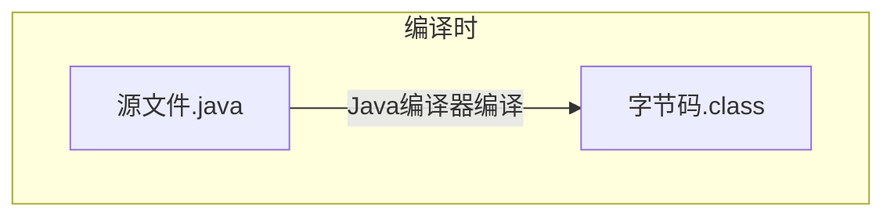
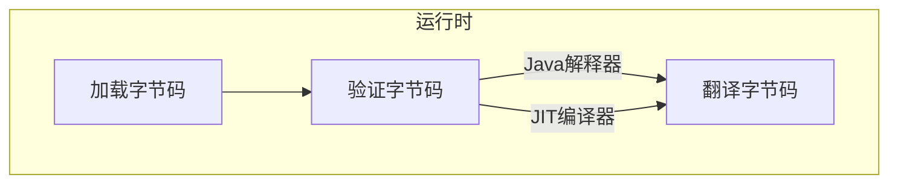

# 关于Java

## 程序类型

### Java应用程序(Java Application)  

可以独立运行  

### Java小应用程序(Java Applet)  

不能独立运行，可以使用appletviewer或其他支持Java的浏览器运行  

## 开发环境

### 运行所需

Java运行环境(Java Run Environment,JRE)  
包含Java虚拟机以及API类库  

### 开发所需

Java开发工具包(Java Development Kit,JDK)  
包含JRE、Java编译器、调试工具  

辅助：集成开发环境(Integrated Development Environment,IDE)  
Visual Studio, Eclipse 等，创建项目，添加源代码以外的资源  

### 不使用IDE开发

在命令行中用`javac`命令编译源码并使用`java`命令执行以类名为文件名的字节码文件  
**执行时省略字节码文件的扩展名**否则会提示找不到或无法加载主类  

```DOS
javac filename.java
java classname
```

在添加了package后将使用另一种方法[详见此](https://blog.csdn.net/weixin_42247720/article/details/81334611)  
需要注意此方法会生成与源文件中类数量及类名相同的字节码文件，缺少main()方法的字节码文件无法执行  


## 工作机制

### 开发Java程序

按照Java语法编写java源代码，再由编译器编译为字节码  
字节码不能直接执行，需要由JVM在执行期间编译成机器码才能执行  



### 运行Java程序（运行时）

在Java虚拟机(JVM)中：  
类加载器，字节码校验器，Java解释器，JIT实时编译器  



#### 加载字节码  

类加载器获取网络或本地的类文件字节码  

#### 验证字节码  

字节码校验器检查类文件格式是否正确  

#### 翻译字节码  

在拥有Java程序的本地Java虚拟机将字节码转为机器语言代码  
Java解释器将字节码翻译成机器语言代码  
JIT编译器也可将字节码转为机器语言代码但其可使解释执行的虚拟机提高到编译时执行的效率（概括就是可以加速执行）  


