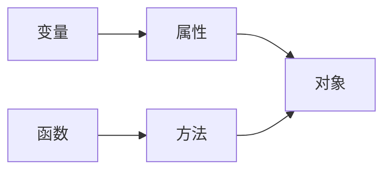

# JavaScript语法

<span style="color:green">就列出和C不一样或者C没有的点，所以没列出的就表示和C一样的语法</span>

## 运算符

### 算数运算符

#### **

ES7新特性

```javascript
// 表示2的三次方
2**3 == 8; //结果：true
```

#### 运算注意

* 尽量避免利用浮点数进行计算，可以将参与计算的数据转换为整数计算后再转为浮点数
    > ```javascript
    > 1.66 + 1.77 == 3.42999997 //结果只是个例子，具体多少个⑨不必在意
    > (1.66 * 100 + 1.77 * 100) / 100 == 3.43
    > ```

* 在进行计算时布尔值会被转换成`Number`类型
    > `true`会被转成`1`,`false`转成`0`

### 字符串运算符

#### +

操作数有一个是字符串则表示进行字符串拼接，否则就是表示加法的算数运算符

```javascript
alert('220' + '230');
alert('220' + 230);
alert(220 + '230');
alert(220 + 230);
alert('220 + 230 = ' + 220 + 230);
alert('220 + 230 = ' + (220 + 230));
```
> 输出0：220230  
> 输出1：220230  
> 输出2：220230  
> 输出3：450  
> 输出4：220 + 230 = 220230  
> 输出5：220 + 230 = 450  

**tips:** 可以使用`数据 + ''`的方式将其他类型的数据与空字符串拼接转换成字符串类型

#### ==

可以连接两个字符串判断字符串是否相等
```javascript
'aaa' == 'aaa' //true
'aaa' == 'a'   //false
```

### 赋值运算符

#### **=

ES7新特性，进行幂运算并赋值

```javascript
a = 2;
a **= 3;
a == 8;
```

#### +=

两个操作数都是`Number`时表示相加并赋值
有一个操作数为字符串时表示字符串拼接并赋值

```javascript
a = 'abc';
a += 'def';
a == 'abcdef';
```

### 比较运算符

比较运算符构成的表达式的结果为一个布尔值
不同数据类型的数据进行比较时，首先会自动进行类型转换后比较
> `'123'`与`123`比较时，会先自动把字符串转换成数字再比较

#### === 和 !==

比较时不仅比较操作数的值是否相等，还比较它们的数据类型是否相等

### 位运算符

JS仅能对Number类型的数据进行运算，运算前操作数会被自动转换成二进制(由二进制数组成的32位的串)

#### >>>

表示无符号右移，将左操作数右移右操作数的位数，左边的空位补`0`，不考虑原数的正负
> `>>`进行右移时根据原数的正负在左侧空位补`0(正)`或`1(负)`[参考](https://developer.mozilla.org/zh-CN/docs/Web/JavaScript/Reference/Operators/Bitwise_Operators)  
> <span style="color:green">下面的加号只是用来排版的，空格会被吞╮(╯-╰)╭</span>  
> 例：(9 >> 2)  
> `9 (base 10):++++++00000000000000000000000000001001 (base 2)`  
> `9 >> 2 (base 10): 00000000000000000000000000000010 (base 2) = 2 (base 10)`  
> 例：(-9 >> 2)  
> `-9 (base 10):++++++11111111111111111111111111110111 (base 2)`  
> `-9 >> 2 (base 10): 11111111111111111111111111111101 (base 2) = -3 (base 10)`  
> 例：(-9 >>> 2)  
> `-9 (base 10):+++++++11111111111111111111111111110111 (base 2)`  
> `-9 >>> 2 (base 10): 00111111111111111111111111111101 (base 2) = 1073741821 (base 10)`  
> <span style="color:orange">可是浏览器显示`-9`的二进制是`-1001`啊，难道是省略了前面的吗？</span>  

### 逻辑运算符

<span style="background-color:yellow">CAUTION：只有两个操作数都是布尔值时才返回布尔值，否则返回某个操作数的值</span>
[参考](https://developer.mozilla.org/zh-CN/docs/Web/JavaScript/Reference/Operators/Logical_Operators)  

|       运算符       |       语法       |                               说明                                |
| ------------------ | ---------------- | ----------------------------------------------------------------- |
| 逻辑与，AND（`&&`） | `expr1 && expr2` | 若 `expr1` 可转换为 `true`，则返回 `expr2`；否则，返回 `expr1`。     |
| 逻辑或，OR（`||`）  | `expr1 || expr2` | 若 `expr**1**` 可转换为 `true`，则返回 `expr1`；否则，返回 `expr2`。 |
| 逻辑非，NOT（`!`）  | `!expr`          | 若 `expr` 可转换为 `true`，则返回 `false`；否则，返回 `true`。       |

> 除了`false`, `0`, `null`, `''`, `""`, `undefined`, `NaN`以外的都是`true`

### 运算符优先级


> 优先级：从上到下递减  
> 第二块的头部接在第一块的尾部  

## 数据类型

### 基本数据类型

#### 布尔型(Boolean)

只有`true`和`false`两个值  
<span style="color:green">貌似不能用1和0来表示真假</span>  

```javascript
var flag1 = true;
var flag2 = false;
```

#### 数值型(Number)

不区分整数和浮点数，支持八、十六进制和科学计数法表示，也可以设置为`NaN`表示非数值

```javascript
var oct = 032;        // 八进制值26
var hex = 0x1a;       // 十六进制值26
var fnum1 = 3.16E6;   // 3.16*10^6
var fnum2 = 8.96E-6;  // 8.96*10^-6
```

**关于NaN**:  
> JS中NaN是一个全局对象的属性，初始值就是`NaN`，其没有一个确定值，`NaN`不一定等于`NaN`  
> <span style="color:green">试了一下`NaN == NaN`全是`false`</span>  

#### 字符(串)型(String)

可以用`'...'`或`"..."`作为字符串标注，两者区别在于对内部对引号的解析  
> 双引号内的单引号可以直接使用`"...'...'..."`  
> 单引号内的双引号可以直接使用`'..."..."...'`  
> 但如果在双引号内使用双引号需要反斜杠转义，单引号内同理  
> 空字符串`''` == `0`

**转义序列**
<span style="color:green">好像和C一样，不需过多在意</span>  

#### 空型(Null)

`null`表示空，表示一个不存在或无效的对象或地址

#### 未定义型(Undefined)

变量未赋值时的初始值`undefined`  
注意`undefined`与`null`和`''`和`0`都不相等

### 复合数据类型

#### 对象(Object)

### 数据类型检测

#### typeof操作符

用法：

```javascript
typeof 对象
// 表达式的值为数据类型
```

> 例：  
> ```javascript
> var a = 123;
> alert(typeof a);    // 输出：number
> alert(typeof '123');// 输出：string
> ```

#### 对象原型的扩展函数

```javascript
var data = null;    // 待判断的数据
var type = 'Null';  // 数据类型，首字母要大写
Object.prototype.toString.call(data) == '[object ' + type + ']';
// 返回值：true 或 false
```

### 数据类型转换

#### 转布尔型

```javascript
Boolean(对象); // 返回值：true 或 false
```

> 将非空字符串和非0值转换为`true`，将`空字符串`, `0`, `NaN`, `undefined`, `null`转换为`false`

#### 转数值型

使用下列转换函数，下列函数转换纯数字时会忽略前导0
> `0123`转换成`123`

|     待转数据      |  Number()   |             parseInt()              | parseFloat() |
| :--------------: | :---------: | :---------------------------------: | :----------: |
|       特性        |             | 省略小数部分，第二个参数设置进制(2~36) | 转换为浮点数  |
|   纯数字字符串    | 转成对应数字 |             转成对应数字             | 转成对应数字  |
|     空字符串      |      0      |                 NaN                 |     NaN      |
|  数字开头的字符串  |     NaN     |             转成开头数字             | 转成开头数字  |
| 非数字开头的字符串 |     NaN     |                 NaN                 |     NaN      |
|       null       |      0      |                 NaN                 |     NaN      |
|    undefined     |     NaN     |                 NaN                 |     NaN      |
|       true       |      0      |                 NaN                 |     NaN      |
|      false       |      1      |                 NaN                 |     NaN      |

> 转换后进行计算前要判断是否为`NaN`，使用`isNaN()`函数来检测，参数为`NaN`返回`true`
> <span style="color:orange">parseFloat的转浮点数是什么鬼，不是只有Number类型吗，而且Number()也可以啊</span>

#### 转字符型

##### String()

将任何类型转换为字符串

```javascript
var num = 12;
alert(String(num)); // 输出：12
```

##### toString()

除了`null`和`undefined`以外都可以，括号内接受一个数字参数表示进制

```javascript
var num = 2;
alert(num.toString());  // 输出:2
alert(num.toString(2)); // 输出:10(二进制的2)
```

### 对象

## 流程控制

### 跳转语句

`break`和`continue`可以跳转到指定的标签语句
<span style="background-color:yellow">CAUTION:只能跳转到其内嵌的标签中</span>[参考](https://developer.mozilla.org/zh-CN/docs/Web/JavaScript/Reference/Statements/break)
```javascript
outer_block:{

  inner_block:{
    console.log ('1');
    break outer_block;      // breaks out of both inner_block and outer_block
    console.log (':-(');    // skipped
  }

  console.log ('2');        // skipped
}
// 下面这个是错误用法
block_1:{
  console.log ('1');
  break block_2;            // SyntaxError: label not found
}

block_2:{
  console.log ('2');
}
```

## 变量

使用`var`关键字定义变量，变量的数据类型根据上下文在运行时决定  
变量命名：可以用`$`字符  
<span style="color:green">C也可以（gcc 7.5.0)</span>

```javascript
var num1 = 22;
alert(num1);
```

使用`let`关键字定义一个块级作用域的变量，即变量的作用域只在代码块内({}之间)
> ```javascript
> for (let i = 0; i < 10; i++)
>     continue;
> console.log(i); //输出：i is not defined
>
> for (var i = 0; i < 10; i++)
>     continue;
> console.log(i); //输出：10
> ```

> 未初始化的变量默认值为`undefined`

声明变量也可以省略`var`关键字
```javascript
flag = false;
a = 1, b = 2;
```

### 定义常量

用`const`关键字定义变量并初始化，变量名长常使用全大写

```javascript
const PI = 3.14
alert(PI); // 输出：3.14
```

## 函数

### 自定函数

```javascript
function sum(a, b)
{
    return a + b;
}
alert(sum(1,2)); // 输出结果：3
```

## 数组(Array)

数组最后一个元素后的逗号可以存在

### 创建数组

#### 使用Array对象创建数组

```javascript
var area = new Array('Beijin', 'Shanghai', 'Shenzhen');
var score = new Array(1, 2, 50);
var mix = new Array('abc', 12, 43, null, 'aa', undefined);
// 空数组
var emptyArr = new Array(); //括号可省略
// 指定数组长度的创建,不影响之后为数组添加元素，长度也会随之改变
var arr = new Array(3);
console.log(arr);     //输出：(3) [empty x 3]
```

#### 使用[]创建数组

```javascript
var area = ['Beijin', 'Shanghai', 'Shenzhen'];
var score = [1, 2, 50,]; // 最后一个元素的逗号可以存在
var mix = ['abc', 12, 43, null, 'aa', undefined];
// 空数组
var emptyArr = [];
// 含有空存储位的数组
var mood = ['sad', , , , 'happy'];
```
> 使用[]可以创建有空存储位的数组，而使用Array对象不行

### 数组操作

#### 数组长度操作

```javascript
var arr1 = [1,2,3];
var arr2 = [1,,2,3];   //空存储位也会增加长度
alert(arr1.length);    //输出：3
alert(arr2.length);    //输出：4
```

可以给数组的`length`属性赋值来修改数组长度，大于原长会增加空存储位，小于原长会截断丢弃元素

```javascript
var arr1 = [];
arr1.length = 5;
console.log(arr1);     //输出：(5) [empty x 5]
var arr2 = [1,2,3];
arr2.length = 4;
console.log(arr2);     //输出：(4) [1, 2, 3, empty]
var arr3 = [1, , , ,2];
console.log(arr3);     //输出：(5) [1, empty x 3, 2]
arr3.length = 1;
console.log(arr3);     //输出：[1]
```

#### 访问数组元素

```javascript
var arr = ['ko', 'no', 'dio', 'da'];
console.log(arr[3]);    //输出：da
console.log(arr);       //输出：(4) ["ko", "no", "dio", "da"]
alert(arr);             //输出：ko,no,dio,da
```

#### 遍历数组元素

##### for (variable in object) {...} 遍历数组取得索引

```javascript
var arr = [1,2,3];
for (var i in arr) { //将数组的索引赋值给变量i
    alert(arr[i]); //输出：1 2 3(三个弹窗分别显示一个值)
}
```

> for ... in 也可以遍历对象

##### for (variable of object) {...} 遍历数组取得元素值(ES6)

```javascript
var arr = [1,2,3];
for (var i of arr) { //将数组的元素值赋值给变量i
    alert(i); //输出：1 2 3(三个弹窗分别显示一个值)
}
```

#### 数组元素的添加与修改

直接用数组下标选择元素进行赋值，可以不按数字顺序添加元素，中间未设置的元素会以空存储位的形式存在

```javascript
var emptyArr = [];
emptyArr[0] = 1;
emptyArr[3] = 4;
emptyArr[5] = 6;
console.log(emptyArr); //输出：(6) [1, empty × 2, 4, empty, 6]
emptyArr[0] = 10;
emptyArr[1] = 11;
console.log(emptyArr); //输出：(6) [10, 11, empty, 4, empty, 6]
```

#### 数组元素的删除

使用`delete`关键字将指定元素的值设为空存储位
```javascript
var arr = [1, 2, 3];
delete arr[1];
console.log(arr);  //输出：(3) [1, empty, 3]
```

### 解构赋值（ES6)

```javascript
var arr = [1, 2, 3];
[a, b, c] = arr;
console.log(a, b, c);    //输出：1 2 3
[a, b, c] = [2, 3, 3];
console.log(a, b, c);    //输出：2 3 3
[a, b, c] = [2, ,3];
console.log(a, b, c);    //输出：2 undefined 3
[a, b, c] = [1, 2, 3, 4];
console.log(a, b, c);    //输出：1 2 3
[a, b, c] = [1, 2];
console.log(a, b, c);    //输出：1 2 undefined
```

使用解构赋值的方式交换两个变量的值

```javascript
var val1 = 2;
var val2 = 3;
[val1, val2] = [val2, val1];
console.log(val1, val2);
```

## 对象



使用`.`来访问对象的属性或方法，对象和方法的区别为有无`()`

### window 对象

> `window.console`       // 访问window对象的的console属性  
> `window.document`     // 访问window对象的document属性  
> `console.log()`        // 访问console对象的log方法  
> `document.write()`  // 访问document的write方法  
> `console`和`document`既是属性也是对象  

### document 对象

通过JS访问或修改元素时需要通过document对象提供的方法创建元素对象进行操作

#### 通过元素id属性操作

```html
<body>
  <div id="test">Hello</div>
  <script>
    var test = document.getElementById('test'); //根据元素id创建元素对象
    alert(test.innerHTML); //通过innerHTML属性获取元素内容
  </script>
</body>
```

### String 对象

直接定义一个字符串就可以作为String对象使用

```javascript
var str = 'apple';
alert(str.length);           // 获取字符串长度
alert(str.toUpperCase());    // 获取字符串转大写后的结果
alert('apple'.toUpperCase());// 同上
```

### 自定对象

```javascript
var stu = {};    // 创建一个名为stu的空对象
stu.name = '小明'; // 为对象添加name属性
stu.gender = '男';
stu.age = 18;
stu.introduce = function () { // 添加方法
    return '我叫' + this.name + '今年' + this.age + '岁。';
    // 用this指代当前对象，可以使对象内部不依赖对象外部的变量名
};
// 访问对象的属性和方法
alert(stu.name);
alert(stu.introduce()); //输出：我叫小明，今年18岁
```

## 事件

可以被JS侦测到的交互行为，事件发生后可以用JS实现交互效果

### onclick事件

元素被点击时产生

```html
<body>
  <input id="btn" type="button" value="test">
  <script>
  document.getElementById('btn').onclick = function () // 给元素对象设置onclick事件
  {
      alert(this.value); // this表示当前发生事件的元素对象
  }
  </script>
</body>
```