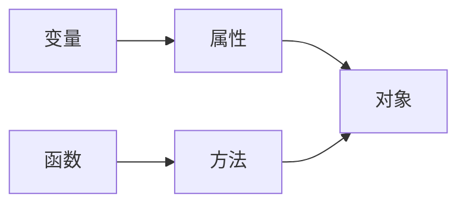

# JavaScript语法

## 运算符

### +

当其中一个操作数是字符串时表示字符串拼接，否则表示加法运算
计算顺序：从左到右

### 字符串拼接

#### 字符串 + 字符串

```javascript
alert('220' + '230');
```
> 输出：220230

#### 字符串 + 数值

```javascript
alert('220' + 230);
alert(220 + '230');
alert(220 + 230);
alert('220 + 230 = ' + 220 + 230);
alert('220 + 230 = ' + (220 + 230));
```
> 输出1：220230
> 输出2：220230
> 输出3：450
> 输出4：220 + 230 = 220230
> 输出5：220 + 230 = 450

### ==

可以连接两个字符串判断字符串是否相等

## 数据类型

### 基本数据类型

#### 布尔型(Boolean)

只有`true`和`false`两个值  
<span style="color:green">貌似不能用1和0来表示真假</span>  

```javascript
var flag1 = true;
var flag2 = false;
```

#### 数值型(Number)

不区分整数和浮点数，支持八、十六进制和科学计数法表示，也可以设置为`NaN`表示非数值

```javascript
var oct = 032;        // 八进制值26
var hex = 0x1a;       // 十六进制值26
var fnum1 = 3.16E6;   // 3.16*10^6
var fnum2 = 8.96E-6;  // 8.96*10^-6
```

**关于NaN**:
> JS中NaN是一个全局对象的属性，初始值就是`NaN`，其没有一个确定值，`NaN`不一定等于`NaN`
> <span style="color:green">试了一下`NaN == NaN`全是`false`</span>

#### 字符(串)型(String)

可以用`'...'`或`"..."`作为字符串标注，两者区别在于对内部对引号的解析
> 双引号内的单引号可以直接使用`"...'...'..."`
> 单引号内的双引号可以直接使用`'..."..."...'`
> 但如果在双引号内使用双引号需要反斜杠转义，单引号内同理

**转义序列**
<span style="color:green">好像和C一样，不需过多在意</span>

#### 空型(Null)

`null`表示空，表示一个不存在或无效的对象或地址

#### 未定义型(Undefined)

变量未赋值时的初始值`undefined`
注意`undefined`与`null`和`''`和`0`都不相等

### 复合数据类型

#### 对象(Object)

### 数据类型检测

#### typeof操作符

用法：

```javascript
typeof 对象
// 表达式的值为数据类型
```

> 例：
> ```javascript
> var a = 123;
> alert(typeof a);    // 输出：number
> alert(typeof '123');// 输出：string
> ```

#### 对象原型的扩展函数

```javascript
var data = null;    // 待判断的数据
var type = 'Null';  // 数据类型，首字母要大写
Object.prototype.toString.call(data) == '[object ' + type + ']';
// 返回值：true 或 false
```

### 数据类型转换

#### 转布尔型

```javascript
Boolean(对象); // 返回值：true 或 false
```

> 将非空字符串和非0值转换为`true`，将`空字符串`, `0`, `NaN`, `undefined`, `null`转换为`false`

#### 转数值型

使用下列转换函数，下列函数转换纯数字时会忽略前导0
> `0123`转换成`123`

|     待转数据      |  Number()   |             parseInt()              | parseFloat() |
| :--------------: | :---------: | :---------------------------------: | :----------: |
|       特性        |             | 省略小数部分，第二个参数设置进制(2~36) | 转换为浮点数  |
|   纯数字字符串    | 转成对应数字 |             转成对应数字             | 转成对应数字  |
|     空字符串      |      0      |                 NaN                 |     NaN      |
|  数字开头的字符串  |     NaN     |             转成开头数字             | 转成开头数字  |
| 非数字开头的字符串 |     NaN     |                 NaN                 |     NaN      |
|       null       |      0      |                 NaN                 |     NaN      |
|    undefined     |     NaN     |                 NaN                 |     NaN      |
|       true       |      0      |                 NaN                 |     NaN      |
|      false       |      1      |                 NaN                 |     NaN      |

> 转换后进行计算前要判断是否为`NaN`，使用`isNaN()`函数来检测，参数为`NaN`返回`true`

#### 转字符型

##### String()

将任何类型转换为字符串

```javascript
var num = 12;
alert(String(num)); // 输出：12
```

##### toString()

除了`null`和`undefined`以外都可以，括号内接受一个数字参数表示进制

```javascript
var num = 2;
alert(num.toString());  // 输出:2
alert(num.toString(2)); // 输出:10(二进制的2)
```

### 对象

## 变量

使用`var`关键字定义变量，变量的数据类型根据上下文在运行时决定

```javascript
var num1 = 22;
alert(num1);
```

> 未初始化的变量默认值为`undefined`

声明变量也可以省略`var`关键字
```javascript
flag = false;
a = 1, b = 2;
```

### 定义常量

用`const`关键字定义变量并初始化，变量名长常使用全大写

```javascript
const PI = 3.14
alert(PI); // 输出：3.14
```

## 函数

### 自定函数

```javascript
function sum(a, b)
{
    return a + b;
}
alert(sum(1,2)); // 输出结果：3
```

## 对象



使用`.`来访问对象的属性或方法，对象和方法的区别为有无`()`

### window 对象

> `window.console`       // 访问window对象的的console属性
> `window.document`     // 访问window对象的document属性
> `console.log()`        // 访问console对象的log方法
> `document.write()`  // 访问document的write方法
> `console`和`document`既是属性也是对象

### document 对象

通过JS访问或修改元素时需要通过document对象提供的方法创建元素对象进行操作

#### 通过元素id属性操作

```html
<body>
  <div id="test">Hello</div>
  <script>
    var test = document.getElementById('test'); //根据元素id创建元素对象
    alert(test.innerHTML); //通过innerHTML属性获取元素内容
  </script>
</body>
```

### String 对象

直接定义一个字符串就可以作为String对象使用

```javascript
var str = 'apple';
alert(str.length);           // 获取字符串长度
alert(str.toUpperCase());    // 获取字符串转大写后的结果
alert('apple'.toUpperCase());// 同上
```

### 自定对象

```javascript
var stu = {};    // 创建一个名为stu的空对象
stu.name = '小明'; // 为对象添加name属性
stu.gender = '男';
stu.age = 18;
stu.introduce = function () { // 添加方法
    return '我叫' + this.name + '今年' + this.age + '岁。';
    // 用this指代当前对象，可以使对象内部不依赖对象外部的变量名
};
// 访问对象的属性和方法
alert(stu.name);
alert(stu.introduce()); //输出：我叫小明，今年18岁
```

### 事件

可以被JS侦测到的交互行为，事件发生后可以用JS实现交互效果

#### onclick事件

元素被点击时产生

```html
<body>
  <input id="btn" type="button" value="test">
  <script>
  document.getElementById('btn').onclick = function () // 给元素对象设置onclick事件
  {
      alert(this.value); // this表示当前发生事件的元素对象
  }
  </script>
</body>
```