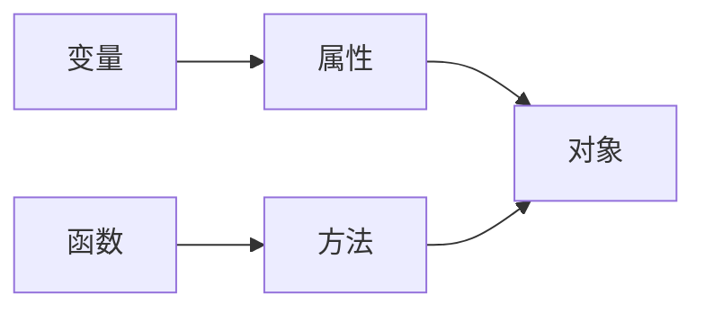

# JavaScript语法

## 运算符

## +

当其中一个操作数是字符串时表示字符串拼接，否则表示加法运算
计算顺序：从左到右

### 字符串拼接

#### 字符串 + 字符串

```javascript
alert('220' + '230');
```
> 输出：220230

#### 字符串 + 数值

```javascript
alert('220' + 230);
alert(220 + '230');
alert(220 + 230);
alert('220 + 230 = ' + 220 + 230);
alert('220 + 230 = ' + (220 + 230));
```
> 输出1：220230
> 输出2：220230
> 输出3：450
> 输出4：220 + 230 = 220230
> 输出5：220 + 230 = 450

### ==

可以连接两个字符串判断字符串是否相等

## 变量

使用`var`关键字定义变量
```javascript
var num1 = 22;
alert(num1);
```

## 函数

### 自定函数

```javascript
function sum(a, b)
{
    return a + b;
}
alert(sum(1,2)); // 输出结果：3
```

## 对象



使用`.`来访问对象的属性或方法，对象和方法的区别为有无`()`

### window 对象

> `window.console`       // 访问window对象的的console属性
> `window.document`     // 访问window对象的document属性
> `console.log()`        // 访问console对象的log方法
> `document.write()`  // 访问document的write方法
> `console`和`document`既是属性也是对象

### document 对象

通过JS访问或修改元素时需要通过document对象提供的方法创建元素对象进行操作

#### 通过元素id属性操作

```html
<body>
  <div id="test">Hello</div>
  <script>
    var test = document.getElementById('test'); //根据元素id创建元素对象
    alert(test.innerHTML); //通过innerHTML属性获取元素内容
  </script>
</body>
```

### String 对象

直接定义一个字符串就可以作为String对象使用

```javascript
var str = 'apple';
alert(str.length);           // 获取字符串长度
alert(str.toUpperCase());    // 获取字符串转大写后的结果
alert('apple'.toUpperCase());// 同上
```

### 自定对象

```javascript
var stu = {};    // 创建一个名为stu的空对象
stu.name = '小明'; // 为对象添加name属性
stu.gender = '男';
stu.age = 18;
stu.introduce = function () { // 添加方法
    return '我叫' + this.name + '今年' + this.age + '岁。';
    // 用this指代当前对象，可以使对象内部不依赖对象外部的变量名
};
// 访问对象的属性和方法
alert(stu.name);
alert(stu.introduce()); //输出：我叫小明，今年18岁
```

### 事件

可以被JS侦测到的交互行为，事件发生后可以用JS实现交互效果

#### onclick事件

元素被点击时产生

```html
<body>
  <input id="btn" type="button" value="test">
  <script>
  document.getElementById('btn').onclick = function () // 给元素对象设置onclick事件
  {
      alert(this.value); // this表示当前发生事件的元素对象
  }
  </script>
</body>
```