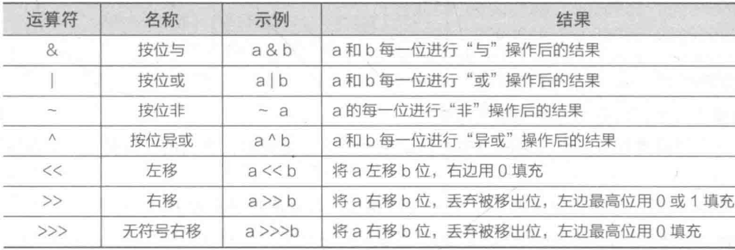
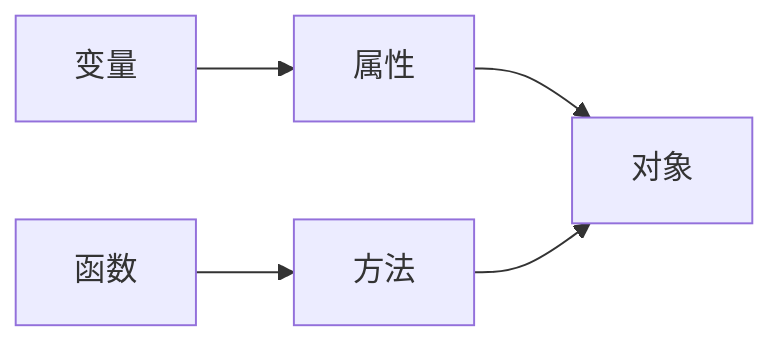
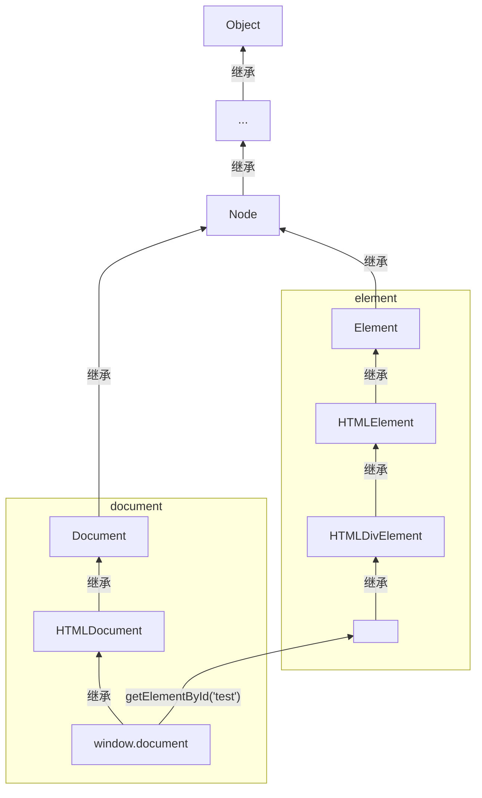

# JavaScript语法

<span style="color:green">就列出和C不一样或者C没有的点，所以没列出的就表示和C一样的语法</span>

## 运算符

### 算数运算符

#### **

ES7新特性

```javascript
// 表示2的三次方
2**3 == 8; //结果：true
```

#### 运算注意

* 尽量避免利用浮点数进行计算，可以将参与计算的数据转换为整数计算后再转为浮点数
    > ```javascript
    > 1.66 + 1.77 == 3.42999997 //结果只是个例子，具体多少个⑨不必在意
    > (1.66 * 100 + 1.77 * 100) / 100 == 3.43
    > ```

* 在进行计算时布尔值会被转换成`Number`类型
    > `true`会被转成`1`,`false`转成`0`

### 字符串运算符

#### +

操作数有一个是字符串则表示进行字符串拼接，否则就是表示加法的算数运算符

```javascript
alert('220' + '230');
alert('220' + 230);
alert(220 + '230');
alert(220 + 230);
alert('220 + 230 = ' + 220 + 230);
alert('220 + 230 = ' + (220 + 230));
```
> 输出0：220230  
> 输出1：220230  
> 输出2：220230  
> 输出3：450  
> 输出4：220 + 230 = 220230  
> 输出5：220 + 230 = 450  

**tips:** 可以使用`数据 + ''`的方式将其他类型的数据与空字符串拼接转换成字符串类型

#### ==

可以连接两个字符串判断字符串是否相等
```javascript
'aaa' == 'aaa' //true
'aaa' == 'a'   //false
```

### 赋值运算符

#### **=

ES7新特性，进行幂运算并赋值

```javascript
a = 2;
a **= 3;
a == 8;
```

#### +=

两个操作数都是`Number`时表示相加并赋值
有一个操作数为字符串时表示字符串拼接并赋值

```javascript
a = 'abc';
a += 'def';
a == 'abcdef';
```

### 比较运算符

比较运算符构成的表达式的结果为一个布尔值
不同数据类型的数据进行比较时，首先会自动进行类型转换后比较
> `'123'`与`123`比较时，会先自动把字符串转换成数字再比较

#### === 和 !==

比较时不仅比较操作数的值是否相等，还比较它们的数据类型是否相等

### 位运算符



> 此处只详述右移运算符 >> 和无符号右移运算符 >>>  

JS仅能对Number类型的数据进行运算，**运算前操作数会被自动转换成由二进制数组成的32位的串**  
**原十进制值转二进制值不满32位会在前端添0或1补齐，（原数为正补0，负数补1）运算时对每一位进行运算**  

```javascript
    var number = -9;
    alert(number); // -9
    number >>>= 0; // 使用右移赋值但是右操作数为0，即只将原数转为32位的串
    alert(number); // 4294967287
    number >>>= 2;
    alert(number); // 1073741821
```


#### >> 与 >>>

`>>`  : 将操作数所有二进制位向右移动指定位数，左边的空位根据原数符号补充（负数补1，正数补0）  
`>>>`: 效果同`>>` ，区别在于在补充左侧空位时不考虑原数正负，统一用`0`补充  

> <span style="color:green">下面的加号只是用来排版的，空格会被吞╮(╯-╰)╭</span>  
> 例1：9 >> 2  
> 9（十进制）= 1001（二进制）
> 9（十进制）>> 2
> 00000000000000000000000000001001（转换后的32位二进制串）>> 2
> 00000000000000000000000000000010（位移后二进制）= 2 （十进制）

> 例2：-9 >> 2  
> -9（十进制）= -1001（二进制）
> -9（十进制）>> 2
> 11111111111111111111111111111001（转换后的32位二进制串）>> 2
> 11111111111111111111111111111110（位移后二进制）= 4294967294（十进制）

> 例3：-9 >>> 2  
> -9（十进制）= -1001（二进制）
> -9 （十进制）>>> 2
> 11111111111111111111111111111001（转换后的32位二进制串）>>> 2
> 00111111111111111111111111111110（位移后二进制）= 1073741822（十进制）

### 逻辑运算符

<span style="background-color:yellow">CAUTION：只有两个操作数都是布尔值时才返回布尔值，否则返回某个操作数的值</span>
[参考](https://developer.mozilla.org/zh-CN/docs/Web/JavaScript/Reference/Operators/Logical_Operators)  

|       运算符       |       语法       |                               说明                                |
| ------------------ | ---------------- | ----------------------------------------------------------------- |
| 逻辑与，AND（`&&`） | `expr1 && expr2` | 若 `expr1` 可转换为 `true`，则返回 `expr2`；否则，返回 `expr1`。     |
| 逻辑或，OR（`||`）  | `expr1 || expr2` | 若 `expr**1**` 可转换为 `true`，则返回 `expr1`；否则，返回 `expr2`。 |
| 逻辑非，NOT（`!`）  | `!expr`          | 若 `expr` 可转换为 `true`，则返回 `false`；否则，返回 `true`。       |

> 除了`false`, `0`, `null`, `''`, `""`, `undefined`, `NaN`以外的都是`true`

### 运算符优先级


> 优先级：从上到下递减  
> 第二块的头部接在第一块的尾部  

### instanceof运算符

```
实例对象 instanceof 构造函数
// 检测构造函数的原型对象是否在实例对象的原型链中

function funcA() {
    this.a = 1;
    this.b = 2;
}
function funcB() {}

var obj = new funcA();
obj.__proto__.c = 3;
obj.__proto__.d = 4;
// 原型链结构
// {a:1, b:2} -> {c:3, d:4} -> Object.prototype -> null
console.log(obj instanceof funcA); // true
console.log(obj instanceof funcB); // false
```

## 数据类型

### 基本数据类型

#### 布尔型(Boolean)

只有`true`和`false`两个值  
<span style="color:green">貌似不能用1和0来表示真假</span>  

```javascript
var flag1 = true;
var flag2 = false;
```

#### 数值型(Number)

不区分整数和浮点数，支持八、十六进制和科学计数法表示，也可以设置为`NaN`表示非数值

```javascript
var oct = 032;        // 八进制值26
var hex = 0x1a;       // 十六进制值26
var fnum1 = 3.16E6;   // 3.16*10^6
var fnum2 = 8.96E-6;  // 8.96*10^-6
```

**关于NaN**:  
> JS中NaN是一个全局对象的属性，初始值就是`NaN`，其没有一个确定值，`NaN`不一定等于`NaN`  
> <span style="color:green">试了一下`NaN == NaN`全是`false`</span>  

#### 字符(串)型(String)

可以用`'...'`或`"..."`作为字符串标注，两者区别在于对内部对引号的解析  
> 双引号内的单引号可以直接使用`"...'...'..."`  
> 单引号内的双引号可以直接使用`'..."..."...'`  
> 但如果在双引号内使用双引号需要反斜杠转义，单引号内同理  
> 空字符串`''` == `0`

**转义序列**
<span style="color:green">好像和C一样，不需过多在意</span>  

#### 空型(Null)

`null`表示空，表示一个不存在或无效的对象或地址

#### 未定义型(Undefined)

变量未赋值时的初始值`undefined`  
注意`undefined`与`null`和`''`和`0`都不相等

### 复合数据类型

#### 对象(Object)

### 数据类型检测

#### typeof操作符

用法：

```javascript
typeof 对象
// 表达式的值为数据类型
```

> 例：  
> ```javascript
> var a = 123;
> alert(typeof a);    // 输出：number
> alert(typeof '123');// 输出：string
> ```

#### 对象原型的扩展函数

```javascript
var data = null;    // 待判断的数据
var type = 'Null';  // 数据类型，首字母要大写
Object.prototype.toString.call(data) == '[object ' + type + ']';
// 返回值：true 或 false
```

### 数据类型转换

#### 转布尔型

```javascript
Boolean(对象); // 返回值：true 或 false
```

> 将非空字符串和非0值转换为`true`，将`空字符串`, `0`, `NaN`, `undefined`, `null`转换为`false`

#### 转数值型

使用下列转换函数，下列函数转换纯数字时会忽略前导0
> `0123`转换成`123`

|     待转数据      |  Number()   |             parseInt()              | parseFloat() |
| :--------------: | :---------: | :---------------------------------: | :----------: |
|       特性        |             | 省略小数部分，第二个参数设置进制(2~36) | 转换为浮点数  |
|   纯数字字符串    | 转成对应数字 |             转成对应数字             | 转成对应数字  |
|     空字符串      |      0      |                 NaN                 |     NaN      |
|  数字开头的字符串  |     NaN     |             转成开头数字             | 转成开头数字  |
| 非数字开头的字符串 |     NaN     |                 NaN                 |     NaN      |
|       null       |      0      |                 NaN                 |     NaN      |
|    undefined     |     NaN     |                 NaN                 |     NaN      |
|       true       |      0      |                 NaN                 |     NaN      |
|      false       |      1      |                 NaN                 |     NaN      |

> 转换后进行计算前要判断是否为`NaN`，使用`isNaN()`函数来检测，参数为`NaN`返回`true`
> <span style="color:orange">parseFloat的转浮点数是什么鬼，不是只有Number类型吗，而且Number()也可以啊</span>

#### 转字符型

##### String()

将任何类型转换为字符串

```javascript
var num = 12;
alert(String(num)); // 输出：12
```

##### toString()

除了`null`和`undefined`以外都可以，括号内接受一个数字参数表示进制

```javascript
var num = 2;
alert(num.toString());  // 输出:2
alert(num.toString(2)); // 输出:10(二进制的2)
```

### 对象

## 流程控制

### 跳转语句

`break`和`continue`可以跳转到指定的标签语句
<span style="background-color:yellow">CAUTION:只能跳转到其内嵌的标签中</span>[参考](https://developer.mozilla.org/zh-CN/docs/Web/JavaScript/Reference/Statements/break)
```javascript
outer_block:{

  inner_block:{
    console.log ('1');
    break outer_block;      // breaks out of both inner_block and outer_block
    console.log (':-(');    // skipped
  }

  console.log ('2');        // skipped
}
// 下面这个是错误用法
block_1:{
  console.log ('1');
  break block_2;            // SyntaxError: label not found
}

block_2:{
  console.log ('2');
}
```

## 变量

使用`var`关键字定义变量，变量的数据类型根据上下文在运行时决定  
变量命名：可以用`$`字符  
<span style="color:green">C也可以（gcc 7.5.0)</span>

```javascript
var num1 = 22;
alert(num1);
```

> 未初始化的变量默认值为`undefined`

声明变量也可以省略`var`关键字
```javascript
flag = false;
a = 1, b = 2;
```

### 定义常量

用`const`关键字定义变量并初始化，变量名长常使用全大写

```javascript
const PI = 3.14
alert(PI); // 输出：3.14
```

### 变量作用域

#### 全局作用域

不在任何函数内声明的变量，或在函数内部省略`var`关键字声明的变量

#### 函数作用域

在函数体内利用`var`关键字声明的变量

#### 块级作用域(ES6)

使用`let`关键字定义一个块级作用域的变量，即变量的作用域只在代码块内({}之间)

```javascript
for (let i = 0; i < 10; i++)
    continue;
console.log(i); //输出：i is not defined

for (var i = 0; i < 10; i++)
    continue;
console.log(i); //输出：10
```

## 数组(Array)

数组最后一个元素后的逗号可以存在

### 创建数组

#### 使用Array对象创建数组

```javascript
var area = new Array('Beijin', 'Shanghai', 'Shenzhen');
var score = new Array(1, 2, 50);
var mix = new Array('abc', 12, 43, null, 'aa', undefined);
// 空数组
var emptyArr = new Array(); //括号可省略
// 指定数组长度的创建,不影响之后为数组添加元素，长度也会随之改变
var arr = new Array(3);
console.log(arr);     //输出：(3) [empty x 3]
```

#### 使用[]创建数组

```javascript
var area = ['Beijin', 'Shanghai', 'Shenzhen'];
var score = [1, 2, 50,]; // 最后一个元素的逗号可以存在
var mix = ['abc', 12, 43, null, 'aa', undefined];
// 空数组
var emptyArr = [];
// 含有空存储位的数组
var mood = ['sad', , , , 'happy'];
```
> 使用[]可以创建有空存储位的数组，而使用Array对象不行

### 数组操作

#### 数组长度操作

```javascript
var arr1 = [1,2,3];
var arr2 = [1,,2,3];   //空存储位也会增加长度
alert(arr1.length);    //输出：3
alert(arr2.length);    //输出：4
```

可以给数组的`length`属性赋值来修改数组长度，大于原长会增加空存储位，小于原长会截断丢弃元素

```javascript
var arr1 = [];
arr1.length = 5;
console.log(arr1);     //输出：(5) [empty x 5]
var arr2 = [1,2,3];
arr2.length = 4;
console.log(arr2);     //输出：(4) [1, 2, 3, empty]
var arr3 = [1, , , ,2];
console.log(arr3);     //输出：(5) [1, empty x 3, 2]
arr3.length = 1;
console.log(arr3);     //输出：[1]
```

#### 访问数组元素

```javascript
var arr = ['ko', 'no', 'dio', 'da'];
console.log(arr[3]);    //输出：da
console.log(arr);       //输出：(4) ["ko", "no", "dio", "da"]
alert(arr);             //输出：ko,no,dio,da
```

#### 遍历数组元素

##### for (variable in object) {...} 遍历数组取得索引

```javascript
var arr = [1,2,3];
for (var i in arr) { //将数组的索引赋值给变量i
    alert(arr[i]); //输出：1 2 3(三个弹窗分别显示一个值)
}
```

> for ... in 也可以遍历对象

##### for (variable of object) {...} 遍历数组取得元素值(ES6)

```javascript
var arr = [1,2,3];
for (var i of arr) { //将数组的元素值赋值给变量i
    alert(i); //输出：1 2 3(三个弹窗分别显示一个值)
}
```

#### 数组元素的添加与修改

直接用数组下标选择元素进行赋值，可以不按数字顺序添加元素，中间未设置的元素会以空存储位的形式存在

```javascript
var emptyArr = [];
emptyArr[0] = 1;
emptyArr[3] = 4;
emptyArr[5] = 6;
console.log(emptyArr); //输出：(6) [1, empty × 2, 4, empty, 6]
emptyArr[0] = 10;
emptyArr[1] = 11;
console.log(emptyArr); //输出：(6) [10, 11, empty, 4, empty, 6]
```

#### 数组元素的删除

使用`delete`关键字将指定元素的值设为空存储位
```javascript
var arr = [1, 2, 3];
delete arr[1];
console.log(arr);  //输出：(3) [1, empty, 3]
```

### 解构赋值（ES6)

```javascript
var arr = [1, 2, 3];
[a, b, c] = arr;
console.log(a, b, c);    //输出：1 2 3
[a, b, c] = [2, 3, 3];
console.log(a, b, c);    //输出：2 3 3
[a, b, c] = [2, ,3];
console.log(a, b, c);    //输出：2 undefined 3
[a, b, c] = [1, 2, 3, 4];
console.log(a, b, c);    //输出：1 2 3
[a, b, c] = [1, 2];
console.log(a, b, c);    //输出：1 2 undefined
```

使用解构赋值的方式交换两个变量的值

```javascript
var val1 = 2;
var val2 = 3;
[val1, val2] = [val2, val1];
console.log(val1, val2);
```

### 数组方法

#### 栈方法

入栈：在数组的末尾或开头添加新元素
出栈：在数组的末尾或开头删除元素

|     方法名 |                       功能描述                        |
| -------- | ----------------------------------------------------- |
|    push() | 将一个或多个元素添加到数组的末尾，并返回数组的新长度      |
| unshift() | 将一个或多个元素添加到数组的开头，并返回数组的新长度      |
|     pop() | 从数组的末尾移出并返回一个元素，若是空数组则返回undefined |
|   shift() | 从数组的开头移出并返回一个元素，若是空数组则返回undefined |

#### 检索方法

|     方法名称     |                          功能描述                          |
| --------------- | --------------------------------------------------------- |
| includes()      | 用于确定数组中是否含有某个元素， 含有返回true ， 否则返回false |
| Array.isArray() | 用于确定传递的值是否是一个Array ， 是返回true, 不是返回false  |
| indexOf()       | 返回在数组中可以找到给定值的第1 个索引， 如果不存在， 则返回-1 |
| lastIndexOf()   | 返回指定元素在数组中的最后一个的索引， 如果不存在则返回-1      |

##### `includes()`

```javascript
数组.includes(待查找的值, 偏移量(从什么地方开始));
下标大于数组长度不搜索返回false，小于0表示数组长度加上该值(结果仍小于0检索整个数组)
```

```javascript
var data = ['peach', 'pear', 26, '26', 'grade'];
// 从下标为3的地方开始搜索
console.log(data.includes(26, 3));    //输出：false
// 从下标为1的地方开始搜索
console.log(data.includes(26, 1));    //输出：true
// 从下标为data.length - 3的地方开始搜索
console.log(data.includes(26, -3));   //输出：true
```

`indexOf()`的第二个参数特性与`includes()`相同

##### `lastIndexOf()`

从后往前搜索，第二个参数大于等于数组长度会搜索整个数组，为负数则索引位置等于数组长度加上该值，若仍为负数则返回-1

#### 数组转字符串

|  方法名称   |              功能描述               |
| ---------- | ----------------------------------- |
| join()     | 将数组的所有元素连接到一个字符串中     |
| toString() | 返回一个字符串, 表示指定的数组及其元素 |

`join()`可以指定连接`数组元素`的符号  
数组元素为`undefined`, `null`时, 对应元素会被转为空字符串

```javascript
console.log(['a', 'b', 'c'].join());            //输出:a,b,c
console.log([[4, 5], [1, 2], [3, 4]].join('-'));//输出:4,5-1,2-3,4
console.log(['a', 'b', 'c'].toString());        //输出:a,b,c
console.log([[4, 5], [1, 2]].toString());       //输出:4,5,1,2
```

#### 其他方法

|  方法名称  |                       功能描述                        |
| --------- | ----------------------------------------------------- |
| sort()    | 对数组的元素进行排序,并返回数组                         |
| fill()    | 用一个值填充(修改)数组中指定下标范围内的全部元素          |
| reverse() | 颠倒数组中元素的位置                                    |
| splice()  | 对一个数组在指定下标范围内删除或添加元素                 |
| slice()   | 从一个数组的指定下标范围内复制数组元素到一个新数组中并返回 |
| concat()  | 将值添加到数组后返回一个新数组                          |

> 只有`slice()`和`concat()`会返回新数组而不修改原数组

##### `fill()`

```javascript
var arr = [1, 9, , 5, 6];
console.log(arr);    //输出：(5) [1, 9, empty, 5, 6]
arr.fill(1, 0, 10);  // 把第0号到末尾的元素替换为1
console.log(arr);    //输出：(5) [1, 1, 1, 1, 1]
```

> 后两个位置参数指定的值大于末尾索引则表示数组末尾，其他情况同splice()中的位置指示参数

##### `splice()`

```javascript
var arr = ['a', 'b', 'c', 'd'];
console.log(arr);         //输出：(4) ["a", "b", "c", "d"]
arr.splice(2, 2);         // 从第2号元素开始删除两个元素
console.log(arr);         //输出：(2) ["a", "b"]
arr.splice(0,0,'e', 'f'); // 从第0号元素开始添加元素
console.log(arr);         //输出：(4) ["e", "f", "a", "b"]
arr.splice(1,0,'hello');  // 从第1号元素开始添加元素
console.log(arr);         //输出：(5) ["e", "hello", "f", "a", "b"]
arr.splice(1,1,'bye');    // 从第一号元素开始删除一个元素，并添加元素(相当于替换元素)
console.log(arr);         //输出：(5) ["e", "bye", "f", "a", "b"]
```

> 第一个参数大于等于数组长度则从数组末尾开始操作，若为负数则表示数组长度加上该值的位置，若仍为负数则从开头操作。

##### `concat()`

```javascript
var arr = [1, 2, 3];
var arr2 = ['a', 'b'];
console.log(arr);                        //输出： (3) [1, 2, 3]
console.log(arr.concat(8, 9, 10, arr2)); //输出：(10) [1, 2, 3, 8, 9, 10, "a", "b"]
```

## 函数

### 自定函数

```javascript
function sum(a, b)
{
    return a + b;
}
alert(sum(1,2)); // 输出结果：3
```

> 函数名命名规则与变量相同
> 函数的调用可以在函数定义前

#### 设置形参

##### 形参默认值(ES6)

```javascript
function greet(name, say = "Hi, I'm ")
{
    alert(say + name);
}
// 没有传入第二个参数时将使用默认值
```

##### 可变参数

###### 参数列表留空使用arguments数组

```javascript
function transferParam()
{
    console.log(arguments.length);
    console.log(arguments);
    for (let i in arguments)
      alert(arguments[i]);
}
transferParam(1, 2, 'a');
//输出
//3
//Temp.html:12 Arguments(3) [1, 2, "a", callee: ƒ, Symbol(Symbol.iterator): ƒ]
//3个alert()弹窗，值分别为1 2 a
```

###### 剩余参数(ES6)

创建一个`...变量名`的形参用于接收剩余参数  

```javascript
function transferParam(argv1, ...argvs)
{
    console.log(argv1); //输出第一个参数
    console.log(argvs); //输出剩余接收到的参数
}
transferParam(1, 2, 'a');
//输出
//1
//Temp.html:12 (2) [2, "a"]
```

#### 作用域链

内层函数在当前作用域中寻找变量，若未找到则向上一级作用域中寻找，直到全局作用域

```javascript
var i = 10;
function fn1()
{
    var i = 5;
    function fn2()
    {
        function fn3()
        {
            console.log(i); //输出：5
        }
        fn3();
    }
    fn2();
}
fn1();
```

### 匿名函数

#### 函数表达式

将函数赋值给一个变量，之后使用`变量名()`来调用函数，定义必须在调用前

```javascript
console.log(fn(1,2));  //错误调用-输出：fn is not a function
var fn = function sum(x, y) //定义函数表达式
{
    return x + y;
};
console.log(fn(1,2));   //输出：3
console.log(sum(1,2));  //错误调用-输出：sum is not defined
```

#### 匿名函数的使用方法

```javascript
// 函数表达式中省略函数名
var sum = function (x, y) {return x + y;};
console.log(sum(1,1)); //输出：2
// 将函数定义用括号包裹(这是一次性函数吗，那还有什么意义)
console.log( (function (x, y) {return x + y;})(1,1) );
// 添加事件处理
document.body.onclick = function() {alert('Hello');};
// 因为函数体只有一行所以就放一行了
```

#### 箭头函数(ES6)

```javascript
// 标准语法
(参数列表) => {函数体}
// 函数体只有一条return语句可以省略return和{}
(参数列表) => {return expression;} 等价于 (参数列表) => expression
// 只有一个参数可以省略()
参数 => {函数体}
// 无参数需要保留()或使用一个_
() => {函数体} 等价于 _ => {函数体}
```

```javascript
//例：
var sum = (x, y) => x + y;
console.log(sum(1,1)); //输出：2
```

#### 通过实例化Function构造函数来创建函数

`Function()`的第一个到第n个参数是创建的函数的参数列表，最后一个参数是函数体
<a href="#toc_90">相关参考：构造函数</a>
<a href="#toc_122">相关参考：函数的构造函数</a>

```javascript
// new Function('参数1', '参数2', ..., '函数体');
var addNum = new Function('x', 'y', 'return x + y');
console.log(addNum(1, 2)); // 3
```

### 闭包函数

闭包函数可以在函数外部读取函数内部的变量，并能让函数内部的变量一直保存在内存中

```javascript
function fn()
{
    var times = 0;
    var c = function () { return ++times; };
    return c;
}
var count = fn();
console.log(count()); //输出：1
console.log(count()); //输出：2
console.log(count()); //输出：3
```

## 对象



使用`.`来访问对象的属性或方法，对象和方法的区别为有无`()`

### 自定对象

#### 定义和初始化对象

```javascript
var obj1 = {};     //定义空对象
var obj2 = {name: 'Jim'}; //定义含有name属性的对象
var obj3 = {       //定义含有两个属性的对象
  name: 'Jim',
  age: '19
};
```

> 字面量语法：在源码中直接书写的一个表示数据和类型的量，如`123`(数值型), `'123'`(字符型), `[123]`(数组)

#### 添加和访问对象成员

```javascript
var boki = {};         // 创建一个名为boki的空对象
boki.name = '吉良吉影'; // 为对象添加name属性
boki.age = 33;
boki.introduce = function () { // 添加方法
    return '我的名字叫' + this.name + ',年龄' + this.age + '岁。';
    // 用this指代当前对象，可以使对象内部不依赖对象外部的变量名
};
// 访问对象的属性和方法
alert(boki.name); //输出：吉良吉影
alert(boki.introduce()); //输出：我的名字叫吉良吉影，年龄33岁
```

```javascript
// 使用可变成员名
var boki = {};
var key = 'stand'; //用变量保存属性名
boki[key] = 'killer queen';
// 相当于 boki['stand'] 或 boki.stand
```

```javascript
// 遍历对象成员
var obj = {a: 1, b: 2, c: 3};
for (let i in obj)
    console.log(i + ':' + obj[i]);
// 输出：(\n表示换行，这里用来减少占用空间)
a:1\nb:2\nc:3
```

### 对象操作

#### 判断成员是否存在

```javascript
var obj = {a: 1, b: 2, c: 3};
console.log('a' in obj); //输出：true
console.log('d' in obj); //输出：false
```

#### 对象复制

##### 浅复制(shallow copy)

直接将对象赋值给另一个对象，修改其中一个对象同时也会修改另一个对象

```javascript
var obj1 = {a: 1, b: 2, c: 3};
var obj2 = obj1;
obj2.b = 'bbb';
console.log(obj1); //输出：{a: 1, b: "bbb", c: 3}
console.log(obj2); //输出：{a: 1, b: "bbb", c: 3}
```

##### 深复制(shallow copy)

赋值对象的成员到另一个对象，创建对象真正的副本

```javascript
function DeepCopy(obj)
{
    var o = {};
    for (let i in obj)
        o[i] = (typeof obj[i] === 'object') ? DeepCopy(obj[i]) : obj[i];
    return o;
}
```

### 构造函数

使用构造函数构建同一类对象，通过类创建的对象称为该类的实例，此过程称为实例化

#### 内置构造函数

```javascript
var obj1 = new Object();
var obj2 = {};                //通过字面量{}创建的对象是Object()的实例
var str  = new String('123');
// 查看对象由哪个构造函数创建([native code]表示函数代码是JS内置的)
console.log(obj1.constructor); //输出：ƒ Object() { [native code] }
console.log(obj2.constructor); //输出：ƒ Object() { [native code] }
console.log(str.constructor);  //输出：ƒ String() { [native code] }
```

#### 自定义构造函数

```javascript
var p1 = new Person('Jack', 18);
var p2 = new Person('fuck', 666);
p1.sayHello();    //输出：Hello my name is Jack I'm 18 years old.
p2.sayHello();    //输出：Hello my name is fuck I'm 666 years old.
console.log(p1.constructor); //输出：ƒ Person(name, age)...(函数完整定义)
function Person(name, age)
{
    this.name = name;
    this.age  = age;
    this.sayHello = function () {
    console.log('Hello ' + 'my name is ' + this.name + " I'm " + this.age + ' years old.');
    };
}
```

```javascript
// class关键字(ES6)
class Person // 定义类
{
    constructor (name, age) // 构造方法
    {
        this.name = name;   // 添加属性
        this.age  = age;
    }
    // 定义introduce()方法
    introduce() { console.log('我叫 ' + this.name + ' 今年 ' + this.age + ' 岁。'); }
}
// 实例化会自动调用constructor()方法
var p = new Person('abc', 24);
p.introduce(); //输出：我叫 abc 今年 24 岁。
```

##### 私有成员

在构造函数中使用`var`关键字定义变量，实例对象后无法通过`对象.成员`的方式访问

```javascript
var p = new Person();
console.log(p.name);     //输出：undefined
console.log(p.getName());//输出：boy
function Person ()
{
    var name = 'boy';
    this.getName = function() {return name;};
}
```

##### 静态成员

构造函数使用的成员即为静态成员，相对的是构造函数创建的对象使用的实例成员

```javascript
function Person(name) {
    this.name = name;
}
// 为Person对象添加静态成员
Person.age = 17;
// 构造函数使用静态成员
console.log(Person.age);  // 17
console.log(Person.name); // Person
// 由构造函数创建的对象使用实例成员
var p = new Person('abc');
console.log(p.name);     // abc
console.log(p.age);      // undefined
```

##### return关键字


```javascript
//使用return返回一个基本数据类型，返回的依然是创建的对象
var p = new Person();
console.log(p);       //输出：Person {getName: ƒ}
function Person ()
{
    var name = 'boy';
    this.getName = function() {return name;};
    return 123;
}
```

```javascript
//使用return返回复合数据类型，则返回该类型而不是创建的对象
var p = new Person();
console.log(p);       //输出：(2) [1, 2]
function Person ()
{
    var name = 'boy';
    this.getName = function() {return name;};
    return [1,2];
}
```

##### 函数中的this指向

###### this指向情况

1. 函数作为构造函数调用时，this指向创建的对象
2. 直接通过函数名调用函数时，this指向全局对象(浏览器中为window对象)
3. 将函数作为对象的方法调用时，this指向该对象

```javascript
function func() {return this};
var obj = {func: func};
console.log(func() === window); // true
console.log(obj.func() === obj);// true
```

###### 更改this指向

使用`apply()`和`call()`方法

```javascript
function showObject() {
    console.log(this);
}
showObject();        //输出:Window {...}
showObject.apply({});//输出:{}
showObject.call({}); //输出:{}
showObject();        //输出:Window {...}
```

```javascript
function add() {
    var sum = 0;
    for (let i of arguments)
        sum += i;
    console.log(sum);
}
add.apply({}, [1, 2, 3]); //数组传参，输出:6
add.call({}, 1, 2, 3);    //参数传参，输出:6
```

使用`bind()`方法(ES5)

```javascript
function showName(number) {
    console.log(this.name + ' ' + number);
}
var name = 'Death';
var test = showName.bind({name: 'The world'}, '21');
showName(13); //输出：Death 13
test();       //输出：The world 21
```

### 内置对象

#### window 对象

> `window.console`       // 访问window对象的的console属性  
> `window.document`     // 访问window对象的document属性  
> `console.log()`        // 访问console对象的log方法  
> `document.write()`  // 访问document的write方法  
> `console`和`document`既是属性也是对象  

#### document 对象

通过JS访问或修改元素时需要通过document对象提供的方法创建元素对象进行操作

##### 通过元素id属性操作

```html
<body>
  <div id="test">Hello</div>
  <script>
    var test = document.getElementById('test'); //根据元素id创建元素对象
    alert(test.innerHTML); //通过innerHTML属性获取元素内容
  </script>
</body>
```

#### String 对象

直接定义一个字符串就可以作为String对象使用

```javascript
var str = 'apple';
alert(str.length);           // 获取字符串长度
alert(str.toUpperCase());    // 获取字符串转大写后的结果
alert('apple'.toUpperCase());// 同上
```

##### String对象的常用属性和方法


> 上表的方法结果都通过返回值返回，位置皆从0开始

```javascript
var str = '1234554321';
console.log(str.charAt(3));        //4
console.log(str.indexOf('2'));     //1
console.log(str.lastIndexOf('2')); //8
console.log(str.substring(5));     //54321
console.log(str.substring(4,6));   //55
console.log(str.substr(5));        //54321
console.log(str.substr(4, 2));     //55
console.log(str.split('4'));       //(3) ["123", "55", "321"]
console.log(str.split('4', 2));    //(2) ["123", "55"]
console.log(str.split('4', 3));    //(3) ["123", "55", "321"]
console.log(str.replace('55', '5'));// 123454321
```

#### Number对象

##### Number对象的常用属性和方法


```javascript
var number = 12345.6789;
console.log(number.toFixed()); //12346
console.log(number.toFixed(1));//12345.7
console.log(number.toFixed(6));//12345.678900
console.log(Number.MAX_VALUE); //1.7976931348623157e+308
console.log(Number.MIN_VALUE); //5e-324
```

#### Math对象

##### Math对象的常用属性和方法


```javascript
var num = 1.23;
var n   = 1;
var m   = 100;
console.log(Math.ceil(num));  //2
console.log(Math.floor(num)); //1
console.log(Math.round(num)); //1
console.log(Math.random());   //随机数0.806025420290184
console.log(Math.random() * (n - m) + m); //[m,n]的随机数
console.log(Math.abs(-23));   //23
console.log(Math.abs('-25')); //25
console.log(Math.max(1, 3, 0, 8)); //8
console.log(Math.max('1', '3', '0', '8')); //8
```

#### Date 对象

##### Date对象的常用方法


> 基于当前时间创建对象

```javascript
var date = new Date();
console.log(date.toString());   //Sun Apr 05 2020 10:55:29 GMT+0800 (中国标准时间)
console.log(date.getFullYear());//2020
console.log(date.getMonth());   //4
console.log(date.getDate());    //5
```

> 指定时间创建对象
> 传入时间大于合理范围会自动设置，(月份设置-1被转为去年12月，月份设置12被转为明年1月)

```javascript
// 传入 年、月、日、时、分、秒(月的范围是[0,11])
// 最少需要传入 年和月
var date = new Date(2014, 3, 4, 4, 4, 4);
console.log(date.toString());   //Fri Apr 04 2014 04:04:04 GMT+0800 (中国标准时间)
new Date(2014, 3); //Tue Apr 01 2014 00:00:00 GMT+0800 (中国标准时间)
```

```javascript
// 传入字符串
// 最少需要传入年
var date = new Date('2014-04-4 04:04:04');
console.log(date.toString());   //Fri Apr 04 2014 04:04:04 GMT+0800 (中国标准时间)
new Date('2014'); //Wed Jan 01 2014 08:00:00 GMT+0800 (中国标准时间)
```

### 原型对象

基于同一个构造函数创建的对象会重复独立保存相同的方法

```javascript
function Person(name) {
    this.name = name;
    this.introduce = function () { };
}
var p1 = new Person('Dio');
var p2 = new Person('JOJO');
console.log(p1.introduce === p2.introduce); // false
```

利用原型对象可以保存一些公共的属性和方法，基于原型创建的对象会自动拥有原型的属性和方法
    
```javascript
// 创建一个函数就会自动创建它的原型对象，构造函数为此函数
function func() {}
console.log(func.prototype);
```

```javascript
function Person(name) {
    this.name = name;
}
Person.prototype.introduce = function () { };
var p1 = new Person('Dio');
var p2 = new Person('JOJO');
console.log(p1.introduce === p2.introduce); // true
```

### 继承

在已有的对象的基础上继承其他对象

#### 继承实现方式

##### 继承原型对象

在构造函数的原型中添加属性和方法

```javascript
function Person(name) {
    this.name = name;
}
Person.prototype.sayHi = function () {
    console.log("Hi I'm " + this.name);
}
var p = new Person('spw'); // 继承了原型对象中的sayHi()方法
p1.sayHi();
```

对象创建后修改原型，继承此原型的对象继承来的属性或方法也会变化
<span style="color:green"> **对象里继承来的成员类似于一种链接，原型中的成员改变，对象中对应的成员也会变化**</span>  

```javascript
function Person(name) {
    this.name = name;
}
var p = new Person('A');
console.log(p1.test);    // undefined
// 在Person的原型中添加属性
Person.prototype.test = 'test';
console.log(p1.test);    // test
```

对象自身的成员会遮蔽原型的成员(property shadowing) <a href="#toc_117">参考属性搜索原则</a>
<span style="color:orange">或者说对象只会从原型继承它没有的成员？</span>

```javascript
function Person(name) {
    this.name = name;
    this.say  = function () {console.log('我是构造函数的默认say()方法');}
}
var p = new Person('First');
p.say();    // 输出：我是构造函数的默认say()方法
// 修改Person的原型
Person.prototype.say = function () {console.log('我是修改后的say()方法');};
p.say();    // 输出：我是构造函数的默认say()方法
```

##### 替换原型对象

<span style="color: green">替换原型对象的操作很慢，最好不要用，使用`Object.create()`创建新对象来实现继承更好</span>
[参考](https://developer.mozilla.org/zh-CN/docs/Web/JavaScript/Reference/Global_Objects/Object/proto)
> `[[Prototype]]`表示原型对象, [参考](https://developer.mozilla.org/zh-CN/docs/Web/JavaScript/Inheritance_and_the_prototype_chain)

用另一个对象替换原型，替换后不会改变已创建的对象，重新使用该构造函数创建的对象才是修改过的

```javascript
function Person(name) {}
Person.prototype.say = function () {console.log('我是原型');}

// 创建对象p1, p1的创建在替换前,所以是默认值
var p1 = new Person();

// 替换原型
Person.prototype = {
    say: function () {console.log('我是替换后的');}
}
// 如果使用下面这条语句则是修改原型，结果是对象p1和p2的say()方法都会输出"我是替换后的"
// Person.prototype.say = function () {console.log('我是替换后的');}

// 创建对象p2, 因为p2的创建在替换后，所以该对象的方法是替换后的
var p2 = new Person();
p1.say(); // 我是原型
p2.say(); // 我是替换后的
```

下面的这个例子中，替换原型没有产生影响，参考上面的"对象自身的成员会遮蔽原型的成员"

```javascript
function Person(name) {
    this.name = name;
    this.say  = function () {console.log('我是构造函数的默认say()方法');}
}
var p1 = new Person('test');
Person.prototype = {
    name: "replaced",
    say : function () {console.log('我是用另一个对象替换原型后的say()方法');}
}
console.log(p1.name);
p1.say();
var p2 = new Person('test2');
console.log(p2.name);
p2.say();
```

##### 利用Object.create()实现继承(ES5)

```javascript
var obj = {
    value: 'test'
}
// 以obj为原型对象，创建一个对象并返回
var newObj = Object.create(obj);
console.log(newObj.value);    // test
```

##### 混入继承

将一个对象的成员加到另一个对象
和原型对象组合使用实现以对象的方式传递参数，或以对象的方式扩展原型的成员

```javascript
// 用来混入继承的extend函数
function extend(o1, o2) {
    for (var k in o2)
        o1[k] = o2[k];
}
```

```javascript
// 用来混入继承的extend函数
function extend(o1, o2) {
    for (var k in o2)
      o1[k] = o2[k];
}
function Person (obj) {
    // 调用前面定义的混入函数，将参数对象的成员添加到实例对象中
    extend(this, obj);
};
Person.prototype.extend = function(obj) {
    // 调用前面定义的混入函数，将参数对象的成员添加到原型对象中
    extend(this, obj);
}
// 给对象原型添加成员
Person.prototype.extend(
    {
      sayHello: function() {console.log('你好，我是' + (this.name || '[没有名字]'));}
    }
);
var p1 = new Person();
var p2 = new Person({name: '张三', age: 666});
p1.sayHello();  //输出：你好，我是[没有名字]
p2.sayHello();  //输出：你好，我是张三
```

### 属性搜索原则

对象访问属性的过程：在当前对象中搜索是否含有该成员，有则使用无则在其原型中查找，若原型也没有则查找原型的原型，直到找到或没找到返回`undefined`

```javascript
function Person() {
    this.name = '我是Person对象的实例属性';
}
Person.prototype.name = '我是Person对象的原型的属性';
var p = new Person();
console.log(p.name);  // 我是Person对象的实例属性
delete p.name;
console.log(p.name);  // 我是Person对象的原型的属性
delete Person.prototype.name;
console.log(p.name);  // undefined
```

> 属性搜索原则只对属性的访问有效，对于属性的添加与修改都是在当前对象中操作

### 原型链

#### 对象的构造函数

原型对象有一个`constructor`属性，指向它的构造函数
基于构造函数创建的实例对象访问的`constructor`属性通常是其原型的链接

```javascirpt
function Person() {}
Person.prototype.constructor === Person //true
```

#### 对象的原型对象

```javascript
function Person() {}
new Person().constructor.prototype === Person.prototype; //true
```

#### 函数的构造函数

自定义函数和内置构造函数的构造函数是`Function`函数，其构造函数是其本身

```javascript
function Person() {}
Person.constructor === Function; //true
Number.constructor === Function; //true
String.constructor === Function; //true
Function.constructor === Function; //true
```

#### 原型对象的原型对象

##### 使用`__proto__`访问原型对象

因为使用`对象.constructor.prototype`的方法无法得到原型对象的原型对象，所以一些浏览器为对象添加了`__proto__`属性以访问原型

```javascript
function Person() {}
new Person().__proto__ === Person.prototype; //true
```

`对象.constructor.prototype`访问到的是该对象当前继承的原型对象的构造函数的原型对象，不一定是实际构造构造函数的原型对象，通过`__proto__`可以访问到实际构造函数的原型对象

```javascript
function Person() {}
function Func() {}
Person.prototype = new Func();
var p1 = new Person();
p1.constructor === Func;           // true
p1.constructor.prototype === Func.prototype; // true
p1.__proto__ === Person.prototype; // true
```

##### 一些原型对象的原型对象

```javascript
function Person() {}
Person.prototype.__proto__ === Object.prototype; // true
Object.prototype.__proto__ === null // true
```

##### 使用`Object.get(set)ProtorypeOf()`获取和修改原型对象

```javascript
function Person() {}
Person.prototype.a = 3;
var p = new Person();

console.log(p.__proto__.a);               // 3
console.log(Object.getPrototypeOf(p).a);  // 3
Object.setPrototypeOf(p, {a: 5});
console.log(p.__proto__.a);               // 5
console.log(Object.getPrototypeOf(p).a);  // 5
```


#### 原型链的结构

1. 自定义函数及内置构造函数由`Function`函数创建
2. 构造函数有一个原型对象，构造函数通过`prototype`属性指向原型，原型通过`constructor`指向构造函数
3. 由构造函数创建的实例对象，继承自构造函数的原型对象，通过实例对象的`__proto__`属性可以直接访问原型对象
4. 构造函数的原型对象继承自`Object`的原型对象，`Object`的原型对象的`__proto__`属性为`null`


```javascript
// 例：
function f() {
    this.a = 1;
    this.b = 2;
}
var obj = new f();
obj.__proto__.c = 3;
obj.__proto__.d = 4;
// 原型链结构
// {a:1, b:2} -> {c:3, d:4} -> Object.prototype -> null
```

## BOM

浏览器提供的内置对象组织起的模型


### window对象

#### 全局作用域

全局作用域的变量函数都可以被window对象调用， 调用window对象的成员可以省略`window.`

```javascript
var num = '123';
function getNum() {
    return this.num;
}
console.log(window.num);         // 123
console.log(getNum());           // 123
console.log(window.getNum());    // 123
console.log(window.Number(num)); // 123
```

定义在全局作用域中的函数内部的this指向window对象
<span style="color:green">但作为构造函数调用时指向创建的对象[构造函数中的this指向](#toc_98)</span>

```javascript
var num = '123';
function getNum() {
    this.num = '222';
}
console.log(num); // 123
console.log((new getNum()).num); // 222
console.log(num); // 123
```

直接使用一个未定义的变量会出错，但通过`window.变量名`的方式不会报错而是`undefined`

```javascript
console.log(a);        // Uncaught ReferenceError: a is not defined
console.log(window.a); // undefined
```

`delete`关键字可以删除window对象的属性，但对全局变量无效

```javascript
var a    = 1;
window.b = 2;
// delete 对全局变量无效
delete a;
console.log(a); // 1
console.log(window.b); // 2
// delete 对window的属性有效
delete window.b;
console.log(window.b); // undefined
```

#### 对话框和窗口

常用的窗口相关的属性和方法  


##### window.open()

```javascript
open(URL, name, specs, replace);
// URL: 打开页面的URL，没指定则打开一个空白窗口
// name: 指定target属性或窗口名
// specs: 设置浏览器窗口的特征的字符串， 多个特征之间使用逗号分隔(在引号内)
// replace: 可选布尔值，是否替换当前窗口，默认false
```

name的可选值：

specs的可选值：

<span style="color:green">设置了specs以后会以新窗口的形式打开窗口, (优先级低于浏览器的弹出窗口打开设置)</span>  


##### 例：打开与关闭窗口

```html
<body style="font-family: Consolas;">
    <p><input type="button" value="打开窗口" onclick="openWin()"></p>
    <p><input type="button" value="关闭窗口" onclick="closeWin()"></p>
    <p><input type="button" value="检查窗口" onclick="checkWin()"></p>
    <p id="msg"></p> <!-- 显示检查消息 -->
    <script>
    var myWindow;
    function openWin()
    {
        myWindow = open('', 'newWin', 'width=400, height=200, left=200');
        myWindow.document.write('<p>窗口名称:' + myWindow.name + '</p>');
        myWindow.document.write('<p>该窗口的夫窗口地址' + myWindow.parent.location + '</p>');
    }
    function closeWin()
    {
        myWindow.close();
    }
    function checkWin()
    {
        if (myWindow)
            var str = myWindow.closed ? '窗口已关闭' : '窗口未关闭';
        else
            var str = '窗口未打开';
        document.getElementById('msg').innerHTML = str;
    }
    </script>
</body>
```

#### 窗口的大小和位置操作

用来设置窗口的位置和大小的一些属性和方法


> 表中的方法都只能对`window.open()`打开的窗口使用

```html
<body style="font-family: Consolas;">
  <p><input type="button" value="打开窗口" onclick="openWin()"></p>
  <p id="control">
    调整窗口<br>
    <input type="button" value="+" onclick="changeWin('add_height')">
    <input type="button" value="⬆" onclick="changeWin('move_up')">
    <input type="button" value="-" onclick="changeWin('sub_height')"> </br>
    <input type="button" value="⬅" onclick="changeWin('move_left')">
    <input type="button" value="✖" onclick="closeWin()">
    <input type="button" value="➡" onclick="changeWin('move_right')"> </br>
    <input type="button" value="+" onclick="changeWin('add_width')">
    <input type="button" value="⬇" onclick="changeWin('move_down')">
    <input type="button" value="-" onclick="changeWin('sub_width')">
  </p>
  <p id="msg"></p> <!-- 显示检查消息 -->
  <script>
    var myWindow;
    function openWin()
    {
      myWindow = open('', 'newWin', 'width = 400, height = 400');
      myWindow.document.write('<p>窗口名称:' + myWindow.name + '</p>');
      myWindow.document.write('<p>该窗口的夫窗口地址' + myWindow.parent.location + '</p>');
      getPosSize();
    }
    function getPosSize()
    {
      var x    = myWindow.screenLeft,  y    = myWindow.screenTop;
      var inH  = myWindow.innerHeight, inW  = myWindow.innerWidth;
      var outH = myWindow.outerHeight, outW = myWindow.outerWidth;
      myWindow.document.write('<p>相对屏幕窗口的坐标:' + 'x:' + x + ',' + 'y:' + y + '</p>');
      myWindow.document.write('<p>文档的高度和宽度:' + 'h:' + inH + ',' + 'w:' + inW + '</p>');
      myWindow.document.write('<p>窗口的高度和宽度:' + 'h:' + outH + ',' + 'w:' + outW + '</p>');
      myWindow.document.write('<hr>');
    }
    function changeWin(mode)
    {
      switch (mode)
      {
      case 'add_height':
        myWindow.resizeBy(0,10);
        break;
      case 'add_width':
        myWindow.resizeBy(10,0);
        break;
      case 'sub_height':
        myWindow.resizeBy(0,-10);
        break;
      case 'sub_width':
        myWindow.resizeBy(-10,0);
        break;
      case 'move_up':
        myWindow.moveBy(0,-10);
        break;
      case 'move_down':
        myWindow.moveBy(0,10);
        break;
      case 'move_left':
        myWindow.moveBy(-10,0);
        break;
      case 'move_right':
        myWindow.moveBy(10,0);
        break;
      }
    }
    function closeWin()
    {
      myWindow.close();
    }
  </script>
</body>
```

#### 框架操作

```html
<iframe name="frame01"></iframe>
<iframe name="frame02"></iframe>
<iframe name="frame03"></iframe>
<script>
  // 获取框架对象
  window.frames['frame01'].document.write('frame01');
  window.frames.frame02.document.write('frame02');
  window.frames[2].document.write('frame03');
  // 获取框架数量
  console.log(window.length); // 3
</script>
```

#### 定时器


`setInterval()`虽然设置了按周期重复执行，但其本身只执行了一次

```javascript
var n = 0;
setInterval(putMessage, 1000, n); // 设置每隔1秒调用一次putMessage(0)
function putMessage(msg)
{
    console.log(msg); // 输出一直是0
    n++;
}
```

设置和取消定时

```html
<input value="开始计数" type="button" onclick="startCount()">
<input type="text" id="count">
<input value="停止计数" type="button" onclick="stopCount()">
<script>
    var timer = null, c = 0;
    function startCount()
    {
        timer = setInterval(countPerSec, 1000);
    }
    function stopCount()
    {
        clearInterval(timer);
    }
    function countPerSec()
    {
        document.getElementById('count').value = ++c;
    }
</script>
```

### loaction对象

#### 更改URL

|            方法             |                 说明                 |
| --------------------------- | ------------------------------------ |
| `assign(String URL)`        | 在当前标签页载入一个URL(可返回原文档)   |
| `reload(Bool forcedReload)` | 重新载入当前页面(传true时绕过缓存读取)  |
| `replace(String URL)`       | 在当前标签页载入一个URL(不可返回原文档) |

> 有些情况下使用assign()也无法返回, [见此](https://segmentfault.com/q/1010000004898876/a-1020000004903511)

#### 获取和修改URL参数

使用location对象的属性来获取和修改URL
[location对象的属性](https://developer.mozilla.org/zh-CN/docs/Web/API/Location)

```javascript
console.log(location.href); // 获取当前页面的URL
location.href = "http://www.example.com"; // 修改URL
```

<span style="color:green">使用location的属性或方法跳转不会被浏览器拦截窗口</span>
> 测试浏览器：chrome

### history对象

#### 历史记录跳转

| 分类 |        名称        |                说明                 |
| --- | ------------------ | ---------------------------------- |
| 属性 | `length`           | 返回历史列表的网址数                 |
| 方法 | `back()`           | 加载history列表的前一个URL           |
| 方法 | `forward()`        | 加载history列表的后一个URL           |
| 方法 | `go(Number pages)` | 加载history列表的前(+)/后(-)pages个的URL |

> go(1) 等价于 forward(), go(-1) 等价于 back()

#### 添加和修改历史记录

```javascript
[push|replace]State(Object state, String title[, String url])
// state: 状态对象, popstate事件触发时, popstate事件的state属性会包含此对象的副本, 不需要使用则用''
// title: 新页面的标题, 目前浏览器普遍忽视此参数, 故用''
// url  : 新页面的URL, 必须与原URL同源, 可以是绝对路径或相对路径
```

pushState()和replaceState()对历史记录的修改会修改地址栏，但不会马上加载，当再次转到此地址时才会加载
[参考例子](https://developer.mozilla.org/zh-CN/docs/Web/API/History_API#pushState_方法的例子)

> 新页面URL必须与原URL同源：
> <span style="color:green">应该是同一源文件的意思，即新URL必须和原URL指向同一个文件，故只能添加参数和锚点</span>
>
> ```javascript
> var url = location.href; // 原URL
> history.pushState('', '', url + '#a');   // 新URL为原URL添加锚点后的地址
> history.pushState('', '', url + '?p=1'); // 添加参数
> history.pushState('', '', url + '/test1/index.html'); // 错误：新URL与原URL非同源
> ```
>
> 新URL使用绝对路径或相对路径
> ```javascript
> var url = location.href; // 原URL
> // 下面两句效果相同
> history.pushState('', '', url + '#a');   // 新URL为原URL添加锚点后的地址
> history.pushState('', '', '#a');         // 新URL为原URL添加锚点后的地址
> ```

### navigator对象

可以得到一些关于浏览器的信息[详见此](https://developer.mozilla.org/zh-CN/docs/Web/API/Navigator)

### screen对象

用于返回当前渲染窗口中与屏幕相关的信息
[参考](https://developer.mozilla.org/zh-CN/docs/Web/API/Screen)


## DOM

一套规范文档内容的通用型标准  

### DOM HTML

DOM 中为操作HTML文档提供的属性和方法:
文档(document)--HTML文件
元素(element)-----标签
节点(node)--------文档中所有内容

#### DOM HTML 节点树

一个HTML文件可以看作由文档内所有元素组成的节点树

```html
<!DOCTYPE html>
<html>
  <head>
    <meta charset="UTF-8">
    <title>demo</title>
  </head>
  <!-- 我是一个注释节点 -->
  <body style = "font-family: Consolas;">
    <p>This is a paragraph</p>
    <a href="#">link to</a>
  </body>
</html>
```

> 节点分类：
> ----按照位置
> 根节点：`<html>`标签
> 子节点：某一个节点的下一级节点
> 父节点：某一个节点的上一级节点
> 兄弟节点：同一个节点下的子节点
> ----按照作用
> 属性节点：标签的属性名
> 文本节点：标签节点内的文本
> 注释节点：注释内容
> 标签(元素)节点：文档中的标签

```mermaid
graph TD
document --- root
root --- head
root --- comment
root --- body
head --- meta --- charset
head --- title --- titleText
comment --- commentText
body --- p --- pText
body --- a --- href
body --- Style
a --- aText

document[文档<br>document]
root[根元素<br><html>]
head[元素<br><head>]
body[元素<br><body>]
meta[元素<br><meta>]
title[元素<br><title>]
p[元素<br><p>]
a[元素<br><a>]
charset[属性<br>charset]
titleText[文本<br>demo]
Style[属性<br>style]
pText[文本<br>This is a paragraph]
href[属性<br>href]
aText[文本<br>link to]
comment[注释节点]
commentText[文本<br>我是一个注释节点]
```

#### DOM 对象的继承关系

**元素对象**
Element对象提供了用于以元素方式操作文档的属性和方法,如`.tagName`
因Element对象继承自Node对象，所以也有Node对象中的属性和方法,如`.nodeName`
**节点对象**
Node对象提供了用于以节点方式操作文档的属性和方法如`.nodeName`
其他节点操作


继承关系显示例：
```html
<div id="test"></div>
<script>
    console.log(test.__proto__);    // 获取原型对象:HTMLDivElement{...}
    console.log(document.__proto__);// 获取原型对象:HTMLDocument{...}
    // ↑可在控制台中继续向上找原型
    console.log(test.nodeName);     // 通过节点方式获取节点名: DIV
    console.log(test.tagName);      // 通过元素方式获取标签名: DIV
    console.log(document.nodeName); // 通过节点方式获取节点名 #document
    console.log(document.tagName);  // document对象不是元素，故输出为undefined
</script>
```

继承关系图示：



### HTML元素操作

#### 获取元素

##### 通过document对象的方法

|                方法                 |                    说明                    |
| ----------------------------------- | ----------------------------------------- |
| `document.getElementById()`         | 返回对拥有指定id的第一个对象的引用           |
| `document.getElementsByName()`      | 返回带有指定名称的对象引用的集合             |
| `document.getElementsByTagName()`   | 返回带有指定标签名的对象引用集合             |
| `document.getElementsByClassName()` | 返回带有指定类名的对象引用集合               |
| `document.querySelector()`          | 返回匹配到指定元素或CSS选择器的第一个对象引用(HTML5) |
| `document.querySelectorAll()`       | 返回匹配到指定元素或CSS选择器的对象引用集合(HTML5)   |

例1：获得对象为引用
```HTML
<body>
  <p id="phrase" class="phrase" name="phrase"> I'm a phrase. </p>
</body>
<script>
  objById    = document.getElementById('phrase');
  objByClass = document.getElementsByClassName('phrase');
  objByName  = document.querySelector("[name='phrase']");
  console.log(objById);    // <p id="phrase" class="phrase"> I'm a phrase. </p>
  console.log(objByClass); // HTMLCollection [p#phrase.phrase, phrase: p#phrase.phrase]
  console.log(objByName);  // <p id="phrase" class="phrase"> I'm a phrase. </p>
  console.log(objById === objByClass[0]); // true
  // 不延时执行的话就会导致前面的输出和后面一样
  setTimeout(change, 1000);
  function change() {
    objById.innerHTML = 'changed';
    console.log(objById);    // <p id="phrase" class="phrase">changed</p>
    console.log(objByClass); // HTMLCollection [p#phrase.phrase, phrase: p#phrase.phrase]
    console.log(objById === objByClass[0]); // true
    console.log(objById === objByName);     // true
  }
</script>
```

> 修改`objById`同时`objByClass`和`objByName`也被修改，说明使用这些方法返回的是对象引用(浅复制)

例2：`querySelector()`用法
```HTML
<body>
  <p id="phrase" class="phrase" name="phrase"> I'm a phrase. </p>
  <div name="phrase">I'm a divPhrase. </div>
</body>
<script>
  objById    = document.querySelector('#phrase');
  objByClass = document.querySelector('.phrase');
  objByName  = document.querySelector("[name='phrase']");
  objByName2 = document.querySelector("div[name='phrase']");
  objsByName = document.querySelectorAll("[name='phrase']");
  console.log(objById);    // <p id="phrase" class="phrase"> I'm a phrase. </p>
  console.log(objByClass); // <p id="phrase" class="phrase"> I'm a phrase. /p>
  console.log(objByName);  // <p id="phrase" class="phrase"> I'm a phrase. /p>
  console.log(objByName2); // <div name="phrase">I'm a divPhrase. </div>
  console.log(objsByName); // NodeList(2) [p#phrase.phrase, div]
  console.log(objById === objsByName[0]); // true
</script>
```

##### 通过document对象的属性

[属性列表](https://developer.mozilla.org/zh-CN/docs/Web/API/Document#属性)

使用例:

```HTML
<body>
  
  
</body>
<script>
  objImg1 = document.getElementById('img1');
  console.log(document.body);
  console.log(document.images);      // HTMLCollection(2) [img#img1, img#img2, img1: img#img1, img2: img#img2]
  console.log(document.images[0]);   //  
  console.log(objImg1 === document.images[0]); // true(使用两种方法获得的对象一样)
</script>
```

##### 通过Element对象的方法和属性

|         方法/属性         |             说明              |
| ------------------------ | ----------------------------- |
| `getElementsByName()`    | 返回带有指定名称的对象引用的集合 |
| `getElementsByTagName()` | 返回带有指定标签名的对象引用集合 |
| `children`               | 返回所有子元素引用集合          |

> 用法和document对象的同名方法相同

使用例:

```HTML
<body>
  <ul id="number">
    <ol id="odd"> <li>1</li><li>3</li><li>5</li> </ol>
    </br>
    <ol id="even"> <li>2</li><li>4</li><li>6</li> </ol>
  </ul>
</body>
<script>
  // id为number的元素的所有li子元素
  var numberList     = document.getElementById('number').getElementsByTagName('li');
  // id为odd的元素的所有li子元素
  var oddList        = document.getElementById('odd').getElementsByTagName('li');
  // id为odd的元素的所有子元素
  var numberChildren = document.getElementById('number').children;
  console.log(numberList);     // HTMLCollection(6) [li, li, li, li, li, li]
  console.log(oddList);        // HTMLCollection(3) [li, li, li]
  console.log(numberChildren); // HTMLCollection(3) [ol#odd, br, ol#even, odd: ol#odd, even: ol#even]
</script>
```


## 事件

可以被JS侦测到的交互行为，事件发生后可以用JS实现交互效果

### onclick事件

元素被点击时产生

```html
<body>
  <input id="btn" type="button" value="test">
  <script>
  document.getElementById('btn').onclick = function () // 给元素对象设置onclick事件
  {
      alert(this.value); // this表示当前发生事件的元素对象
  }
  </script>
</body>
```