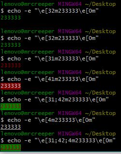

# shell
## 初步
### shebang
shell脚本的第一行：以`#!`起始。  
通常形式：
```
#!/bin/bash //即Bash的路径
```
运行shell脚本时，shell程序会先查看shebang行，然后使用对应的脚本运行shell脚本。  

>例：script.sh的shebang行：#!bin/bash
>运行：`$ ./script.sh`
>会替换为：`/bin/bash/script.sh`
shebang：#(sharp) !(bang)  

### 命令的分隔
用换行符或分号进行分隔。  

### 运行shell 脚本
#### 作为命令行参数
```
$ sh .sh文件名
$ sh .sh文件的完整路径
```

#### 作为可执行文件独立运行
##### 确保具有执行权限
```
$ chmod a+x .sh文件名
```
给所有用户该文件的执行权限。  

##### 执行
```
./文件名 (当前目录)
完整路径/文件名 (使用完整路径)
```

## 终端打印
### echo
```
echo 打印内容
```
打印内容可以用双引号或单引号包围，也可以没有。  
echo在默认情况下会在最后添加一个换行符。  

#### 使用单引号、双引号、或不用的差别
* 单引号
    单引号内的内容将一致输出，无法使用变量和使用`\`进行转义。  
* 双引号
    可以进行转义和使用变量。  
    可以直接输出感叹号。  
* 不用
    与使用双引号的区别可能就在于不能输出分号。  
    <font color='red'>分号作为命令的分隔符。</font>  
    要输出感叹号需要用反斜杠转义。  

#### 使用标志
```
echo 标志 输出内容
```
标志应在字符串前。  
* `-n`
    使末尾不会自动添加换行符。  
* `-e`
    使echo可以使用双引号内的转义序列。  

#### 打印彩色输出
```
echo -e "\e[编码序列m输出内容\e[0m"
```
后面的`\e[0m`是将颜色置回。  
编码之间用分号隔开，可一个或多个编码。  
`m`是编码的结束标志。  
>例：
>

| 编码 | 字体色 | 背景色 |            效果             |
| :--: | :---: | :---: | :-------------------------: |
|  0   |  重置  |  重置  |            重置             |
|  1   |       |       |            高亮             |
|  4   |       |       |            下划线            |
|  5   |       |       |            闪烁             |
|  7   |       |       | 将背景设置为字体色(仍可见字体) |
|  8   |       |       |         使字体不可见         |
| 30  |  黑色  |  ---  |                             |
| 31  |  红色  |  ---  |                             |
| 32  |  绿色  |  ---  |                             |
| 33  |  黄色  |  ---  |                             |
| 34  |  蓝色  |  ---  |                             |
| 35  |  洋红  |  ---  |                             |
| 36  |  青色  |  ---  |                             |
| 37  |  白色  |  ---  |                             |
| 40  |  ---  |  黑色  |                             |
| 41  |  ---  |  红色  |                             |
| 42  |  ---  |  绿色  |                             |
| 43  |  ---  |  黄色  |                             |
| 44  |  ---  |  蓝色  |                             |
| 45  |  ---  |  洋红  |                             |
| 46  |  ---  |  青色  |                             |
| 47  |  ---  |  白色  |                             |

### printf
除了用空格分隔参数、没有括号、格式化字符串的参数字符(串)不需要(双)引号。  
>例：
>`printf "%s" hello
>输出：hello(没有换行符)

## 变量和环境变量
### 变量
在Bash中，每一个变量的值都是字符串。  
变量不需要定义。  

#### 变量赋值
```
变量名=值
```
如果值包含空白符，则需要使用引号。  
<font color='yellow'>注意等号两边没有空格。</font>
<font color='green'>*//使用单引号和双引号的差别看前面*</font>

#### 使用变量
```
$变量名
${变量名}
```
使用花括号包围变量名可避免识别错误。  
>例：
>na="aa"
>echo "$name"
>这里会将变量识别为`name`而不是`na`

#### 得到字符串(变量)长度
```
${#变量名}
```

### 环境变量
被shell环境和操作系统环境用来存储一些特别的值的变量。  
环境变量未在当前进程中定义，而从父进程中继承。  

#### 查看进程的环境变量
```
$ cat /proc/$PID/environ
```
`$PID`是进程的ID，是一个整数。(不带$)。  
<font color='green'>*//当然也可以写在.sh文件里*</font>  
每一个变量以`name=value`的形式描述，彼此之间用空字符(\0)分隔。  
可以在显示时将`\0`替换成`\n`以获得格式化的输出。  
```
$ cat /proc/$PID/environ | tr '\0' '\n'
```
**查看进程ID**
```
$ pgrep 进程名
```

#### 设置环境变量
方法一：
```
export 变量名=值
```
方法二：
```
变量名=值
export 变量名
```
例见下面在PATH中添加一条路径。  

#### 标准环境变量
PATH、HOME、PWD、USER、UID、SHELL  
##### PATH
给出所要执行的命令后，shell会自动在PATH环境变量所包含的目录列表中查找对应的可执行文件。  
各个目录路径之间用冒号隔开。  
$PATH通常定义在`/etc/environment/`或`/etc/profile/`或`~/.bashrc`中。  

###### 在PATH中添加路径
要添加的路径：`/home/user/bin`
方法一：
```
export PATH="$PATH:/home/user/bin"
```
方法二：
```
PATH="$PATH:/home/user/bin"
export PATH
```

##### SHELL
###### 识别当前的shell版本
方法一：
```
echo $SHELL
```
方法二：
```
echo $0
```

##### UID
###### 检查是否为超级用户root
root 用户的UID是0。  

#### 修改Bash提示字符串——环境变量：PS1
##### 查看PS1的设置位置
```
$ cat ~/.bashrc | grep PS1
```
##### PS1的设置
```
PS1='[\u@\h \w]\$ ' (注意$后面有空格)
```
转义字符：  

|  字符   |          \d          |     \H      |      \h      |     \t      |          \T          |
| :-----: | :------------------: | :---------: | :----------: | :---------: | :------------------: |
|  含义   |         日期         | 完整主机名称 | 主机第一个名字 | 24小时制时间 |    十二小时制时间     |
|   例    |      Mon Aug 1       |  fc4.linux  |     fc4      |  22:23:24   |                      |
| ------- |                      |             |              |             |                      |
|  字符   |          \A          |     \u      |      \v      |     \w      |          \W          |
|  含义   | 24小时制时间(不显示秒) |  当前用户名  |   Bash版本    | 完整工作目录 | 工作目录的最后一个目录 |
| ------- |                      |             |              |             |                      |
|  字符   |         \\#          |     \\$     |              |             |                      |
|  含义   |    下达的第几个命令    |   提示字符   |              |             |                      |

还可以设置颜色(看终端打印/打印彩色输出)。  

## 数学运算
### let
只支持整数运算。  
变量名可以不添加$。  
```
let total=val_a+val_b
```
支持加减乘除，`+=`、`-=`、`++`、`--`。  
貌似不支持`%`，试了没用。  
支持的运算符操作与C一样。  
目前没发现嵌入echo的方法。  

### $[]
```
result=$[ val_a + val_b ]
```
中括号里不加空格应该也行(用GitBash运行没问题)。  
注意中括号前有一个美元符号。  
可直接放入echo。  
只支持整数。  

### $(( ))
```
result=$((val_a+val_b))
```
可以直接放入echo。  
GitBash测试中间不需要空格。  
只支持整数。  

### expr
```
`expr val_a + val_b`
```
运算符与操作数间必须要有空格。  
只支持整数。  
可直接放入echo。  

### bc
```
echo "表达式" | bc
```
表达式间可以没有空格。  
将计算结果用于赋值需要使用反引号包围。  
支持浮点数。  

>例：
>```
>no=10
>echo "2 * 0.44" | bc    //会将计算结果输出
>result=`echo "$no * 1.5" | bc` //会将结果赋给result，不会输出
>```

#### 设置小数精度
```
echo "scale=精度数值;表达式" | bc
```

#### 进制转换
```
echo "obase=输出进制;ibase=输入进制;表达式" | bc
```
`ibase`(输入的进制)默认是十进制，可以省略。  
注意`obase`和`ibase`的顺序不能错。  

#### 计算幂和平方根
```
echo "sqrt(100)" | bc //计算100的平方根
echo "10 ^ 10" | bc //计算10的10次方
```

## 文件描述符和重定向
### 文件描述符
与打开的文件或数据流关联的整数。  

| 描述符 |  文件  |
| :---: | :----: |
|   0   | stdin  |
|   1   | stdout |
|   2   | stderr |

### 重定向操作符

| 操作符 |                 操作                  |
| :---: | :-----------------------------------: |
|   >   | 将左边输出重定向至右边文件（会将文件清空) |
|  >>   |   将左边输出重定向至右边文件(追加模式)   |
|   <   | 将右边输出重定向至左边文件(会将文件清空)  |
|  <<   |   将右边输出重定向至左边文件(追加模式)   |

重定向操作符左侧可以添加文件描述符(表示左侧输出文件流)。  


## 运算符
### 算数运算符
使用方式:`expr 值 运算符 值`  
<font color='green'>*//注意有空格*</font>  
功能与C里的一样。  
<font color='orange'>`==`和`!=`应该也是算数运算符，因为只有用expr这种方式才能正常使用</font>

| 运算符 | 功能 | --- |
| ----- | --- | --- |
| +     | --- | --- |
| -     | --- | --- |
| \*    | --- | --- |
| /     | --- | --- |
| %     | --- | --- |
| =     | --- | --- |
| ==    | --- | --- |
| !=    | --- | --- |

### 关系运算符
