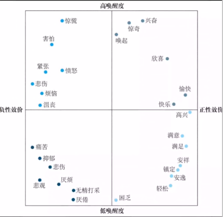

# 情绪与动机

## 描述情绪与情绪的定义

通过情绪体验的相似性使用多维尺度方法绘制情绪体验图
> 方法支持：
> 人们可以描述出一个情绪体验和另一个情绪体验有多相似
> 多维尺度分析方法[参考](https://zhuanlan.zhihu.com/p/49481796)

> 效价：体验有多消极或多积极
> 唤醒度：体验有多主动或多被动
> 情绪可以用该图的坐标来定位

### 定义情绪

一个与特定生理活动模式联系在一起的积极或消极的体验
> 定义的内容：
> 积极或消极程度(多好或多坏)
> 身体唤醒水平(平静到兴奋等激活程度)