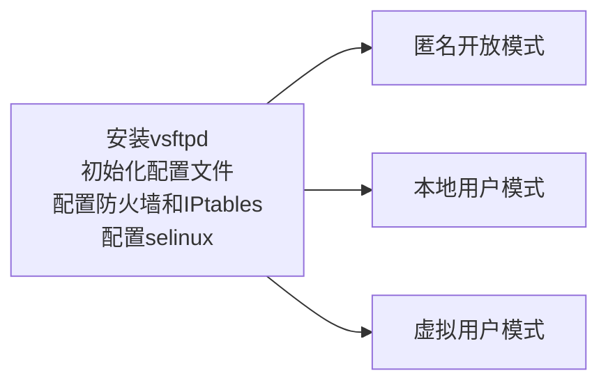

# CentOS 7 使用vsftpd 安装ftp 服务
[参考内容1](https://blog.51cto.com/andyxu/2168875)
[参考内容2](https://www.cnblogs.com/haiyabtx/p/10762745.html)

## 关于vsftpd

### vsftpd有三种认证模式

* 匿名开放模式
    任何人无需密码验证直接登录
* 本地用户模式
    通过Linux系统本地的账户密码信息进行认证
* 虚拟户模式
    为FTP服务单独建立用户数据库文件，虚拟出用来进行口令验证的账户信息，而这些账户信息在服务器系统中实际上是不存在的，仅供FTP服务程序进行认证使用。

### 配置文件的参数和作用

<font color="green">/* *引用51CTO博客 xuad88的表格* */</font>

## 安装流程

<font color="green">/* *项目的链接待会发到github再搞* */</font>



## 流程细节

### 安装vsftpd

```bash
yum -y vsftpd
```

### 初始化配置文件

备份配置文件
```bash
cp /etc/vsftpd/vsftpd.conf /etc/vsftpd/vsftpd.conf.bak
```
清除以`#`开头的注释行；
配置文件初始内容：
```text
anonymous_enable=YES
local_enable=YES
write_enable=YES
local_umask=022
dirmessage_enable=YES
xferlog_enable=YES
connect_from_port_20=YES
xferlog_std_format=YES
listen=NO
listen_ipv6=YES

pam_service_name=vsftpd
userlist_enable=YES
tcp_wrappers=YES
```

### 配置防火墙和IPtables

#### firewall

开放2231和45000-49000端口

```bash
firewall-cmd --permanent --add-port=2231/tcp
firewall-cmd --permanent --add-port=45000-49000/tcp
firewall-cmd --reload
```

<font color="orange">这步尚不明确，不同的教程设置方法有差别，没有安装firewall应该不用搞了了吧？</font>

#### IPtables

<font color="orange">可能并不需要这一步，我后来去除文件中的这些内容依旧可以</font>  

将这两行加到`/etc/sysconfig/iptables`文件尾部

```text
iptables -A INPUT -m state --state NEW -m tcp -p tcp --dport 21 -j ACCEPT
iptables -A INPUT -m state --state NEW -m tcp -p tcp --dport 40000:40010 -j ACCEPT
iptables -A INPUT -m state --state NEW -m tcp -p tcp --dport 2231 -j ACCEPT
iptables -A INPUT -m state --state NEW -m tcp -p tcp --dport 45000:49000 -j ACCEPT
```

使用命令直接添加：

```bash
echo "-A INPUT -m state --state NEW -m tcp -p tcp --dport 21 -j ACCEPT
-A INPUT -m state --state NEW -m tcp -p tcp --dport 40000:40010 -j ACCEPT
-A INPUT -m state --state NEW -m tcp -p tcp --dport 2231 -j ACCEPT
-A INPUT -m state --state NEW -m tcp -p tcp --dport 45000:49000 -j ACCEPT
#add for ftp on`date`" >> /etc/sysconfig/iptables
```

### 配置selinux
```bash
yum -y install policycoreutils-python.x86_64 //没有selinux相关命令要安装这个
setsebool -P ftpd_full_access=on
```

### 匿名开放模式

<font style="background:yellow">/* NOTICE */</font>

其实可以什么都不用搞，安装完vsftpd正常启动后就行了，不用修改配置文件。
启动后匿名登录，用户名用`anonymous`密码为空，登录后会进入`/var/ftp`目录下。
注意要给其他用户`/var/ftp`目录的读取和执行权`x r`方法：`chmod o+rx /var/ftp`

<font color="orange">所以下面一段没用了？</font>  
修改配置文件`/etc/vsftpd/vsftpd.conf`  
注意配置文件不能有多余的空格，注释也要写在另一行  

```bash
anonymous_enable=YES
#启用匿名访问模式
anon_umask=022
#匿名用户上传文件的umask值
anon_upload_enable=YES
#允许匿名用户上传文件
anon_mkdir_write_enable=YES
#允许匿名用户创建目录
anon_other_write_enable=YES
#允许匿名用户重命名、删除等操作
anon_root=/data/anon
#匿名用户的FTP根目录
local_enable=YES
write_enable=YES
local_umask=022
dirmessage_enable=YES
xferlog_enable=YES
connect_from_port_20=YES
xferlog_std_format=YES
listen_port=2231
#vsftpd服务监听的端口号
listen=NO
listen_ipv6=YES
pam_service_name=vsftpd
userlist_enable=YES
tcp_wrappers=YES
pasv_min_port=45000
#PASV模式最小端口号
pasv_max_port=49000
#PASV模式最大端口号
```

## 后记

搞了很久遇到了很多问题后发现，如果用匿名只需要安装vsftpd正常启动就行了，只是要记得登录的目录在`/var/ftp`。  
能用就行了，不想继续搞了。  